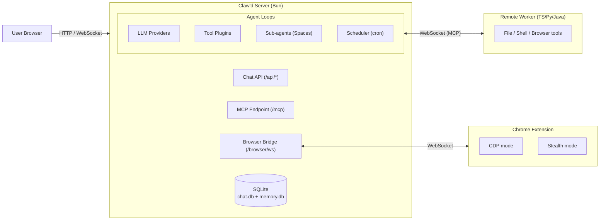

# Claw'd

Claw'd is an open-source platform where AI agents operate autonomously through a real-time collaborative chat interface. Multiple agents can communicate with users and each other, execute code in sandboxed environments, browse the web via a Chrome extension, spawn sub-agents for parallel work, and persist memories across sessions.

**Key highlights:**

- 🤖 **Multi-agent orchestration** — multiple agents per channel, sub-agent spawning (Spaces), scheduled tasks
- 🌐 **Browser automation** — Chrome extension with CDP and stealth mode; remote browser via workers
- 🔒 **Sandboxed execution** — bubblewrap (Linux) / sandbox-exec (macOS) for secure tool execution
- 🧠 **3-tier memory** — session history, knowledge base (FTS5), and long-term agent memories
- 📦 **Single binary** — compiles to one executable with embedded UI and browser extension
- 🔌 **Provider-agnostic** — Copilot, OpenAI, Anthropic, Ollama, Minimax, custom providers
- 🛠️ **MCP support** — both as MCP server (`/mcp` endpoint) and MCP client (external tools)
- 🧩 **Extensible** — custom tools and skills per project (`{projectRoot}/.clawd/`)
- 🌍 **Remote workers** — execute tools on remote machines via WebSocket tunnel (TypeScript, Python, Java)

---

## Quick Start

### Prerequisites

- [Bun](https://bun.sh/) v1.3.9+

### Install & Build

```sh
git clone https://github.com/clawd-pilot/clawd.git
cd clawd
bun install
bun run build    # Builds UI → embeds assets → compiles binary
```

### Run

```sh
# Using compiled binary
./dist/server/clawd-app

# Or development mode (hot reload)
bun run dev          # Server
bun run dev:ui       # UI (from packages/ui/)
```

Open **http://localhost:3456** in your browser.

### Docker

```sh
docker compose up -d
```

See [Docker Deployment](#docker-deployment) for details.

---

## Architecture Overview



The server is a single Bun HTTP+WebSocket process (`src/index.ts`) that serves the embedded React UI, manages agents, and bridges browser automation. Each agent runs its own polling loop with tool execution, context management, and memory persistence.

For the full architecture reference, see **[docs/architecture.md](docs/architecture.md)**.

---

## Configuration

Settings are loaded from CLI flags and `~/.clawd/config.json`. CLI flags take precedence.

### CLI Flags

```sh
clawd-app [options]
  --host <host>       Bind address (default: 0.0.0.0)
  --port, -p <port>   Port number (default: 3456)
  --debug             Enable debug logging
  --yolo              Disable sandbox restrictions for agents
  --no-browser         Don't open browser on startup
```

### config.json Schema

Settings are loaded from `~/.clawd/config.json`:

```jsonc
{
  "host": "0.0.0.0",
  "port": 3456,
  "debug": false,
  "yolo": false,                        // Disable sandbox restrictions
  "dataDir": "~/.clawd/data",           // Data directory override
  "uiDir": "/custom/ui/path",           // Custom UI directory

  "env": {                               // Environment variables (injected into agent sandbox)
    "GITHUB_TOKEN": "ghp_...",
    "CUSTOM_VAR": "value"
  },

  "providers": {                         // LLM providers
    "copilot": {
      "api_key": "github_pat_...",
      "models": { "default": "gpt-4.1", "sonnet": "claude-sonnet-4.6", "opus": "claude-opus-4.6" }
    },
    "anthropic": { "api_key": "sk-ant-..." },
    "openai": { "base_url": "https://api.openai.com/v1", "api_key": "sk-..." },
    "ollama": { "base_url": "https://ollama.com" },
    "groq": {                            // Custom provider (must specify "type")
      "type": "openai",
      "base_url": "https://api.groq.com/openai/v1",
      "api_key": "gsk_...",
      "models": { "default": "llama-3.3-70b-versatile" }
    }
  },

  "mcp_servers": {                       // MCP servers — per-channel
    "my-channel": {
      "github": { "transport": "http", "url": "https://api.githubcopilot.com/mcp", "headers": { "Authorization": "Bearer ..." } },
      "filesystem": { "command": "npx", "args": ["@modelcontextprotocol/server-filesystem"], "enabled": true }
    }
  },

  "quotas": { "daily_image_limit": 50 },// 0 = unlimited

  "model_token_limits": {                // Override built-in token limits (optional)
    "copilot": { "gpt-4.1": 64000 },
    "anthropic": { "claude-opus-4.6": 200000 }
  },

  "workspaces": true,                    // true | false | ["channel1", "channel2"]
  "worker": true,                        // true | { "channel": ["token1"] }
  "browser": true,                       // true | ["ch1"] | { "ch1": ["auth_token"] }
  "memory": true,                        // true | { "provider": "copilot", "model": "gpt-4.1", "autoExtract": true }

  "vision": {
    "read_image": { "provider": "copilot", "model": "gpt-4.1" },
    "generate_image": { "provider": "gemini", "model": "gemini-3.1-flash-image" },
    "edit_image": { "provider": "gemini", "model": "gemini-3.1-flash-image" }
  },

  "auth": {                              // Optional API authentication
    "token": "your-secret-token"         // All /api/* require "Authorization: Bearer <token>"
  }
}
```

### Environment Variables

Environment variables for agents can be set in `~/.clawd/.env`:

```env
GITHUB_TOKEN=ghp_...
NPM_TOKEN=npm_...
CUSTOM_API_KEY=...
```

These are injected into the agent sandbox environment. The file is never exposed to agents directly.

---

## System Files & Directories

```
~/.clawd/                        # Global config directory
├── config.json                  # Application configuration
├── .env                         # Agent environment variables (KEY=VALUE)
├── .ssh/
│   └── id_ed25519               # SSH key for agent Git operations
├── .gitconfig                   # Git config for agents
├── bin/                         # Custom binaries added to agent PATH
├── skills/                      # Global custom skills
│   └── {name}/SKILL.md          # Skill folder with SKILL.md
├── data/
│   ├── chat.db                  # Chat messages, agents, channels
│   ├── kanban.db                # Tasks, plans, phases
│   ├── scheduler.db             # Scheduled jobs and run history
│   └── attachments/             # Uploaded files and images
├── memory.db                    # Agent session memory, knowledge base, long-term memories
└── mcp-oauth-tokens.json        # OAuth tokens for external MCP servers

{projectRoot}/.clawd/            # Project-specific config (not directly accessible by agents)
├── tools/                       # Custom tools
│   └── {toolId}/
│       ├── tool.json            # Tool metadata
│       └── entrypoint.sh        # Tool script (any supported language)
└── skills/                      # Project-scoped skills (read-only + execute for agents)
    └── {name}/
        ├── SKILL.md             # Skill definition
        └── *.sh / *.py          # Optional skill scripts
```

### chat.db

Main application database (SQLite, WAL mode). Contains:

| Table | Purpose |
|---|---|
| `channels` | Chat channels (id, name, created_by) |
| `messages` | All chat messages with timestamps, agent attribution, tool results |
| `files` | File attachment metadata |
| `agents` | Agent registry (display names, colors, worker status) |
| `channel_agents` | Agent ↔ channel assignments with provider, model, project path |
| `agent_seen` | Read tracking (last_seen_ts, last_processed_ts) |
| `agent_status` | Per-channel agent status |
| `summaries` | Context compression summaries |
| `spaces` | Sub-agent space records (parent, status, timeout) |
| `articles` | Knowledge articles |
| `copilot_calls` | API call analytics |
| `users` | User records |
| `message_seen` | User read tracking |

### kanban.db

Task and plan management database (SQLite, WAL mode, `~/.clawd/data/kanban.db`). Contains:

| Table | Purpose |
|---|---|
| `tasks` | Channel-scoped tasks (status, assignee, priority, due dates) |
| `plans` | Plan documents with phases |
| `phases` | Plan phases/milestones |
| `plan_tasks` | Tasks linked to plan phases |

### scheduler.db

Scheduler database (SQLite, WAL mode, `~/.clawd/data/scheduler.db`). Contains:

| Table | Purpose |
|---|---|
| `scheduled_jobs` | Cron/interval/once/reminder/tool_call scheduled tasks |
| `job_runs` | Execution history for scheduled jobs |

### memory.db

Agent session memory and knowledge store (SQLite, WAL mode). Contains:

| Table | Purpose |
|---|---|
| `sessions` | LLM sessions (name format: `{channel}-{agentId}`) |
| `messages` | Full conversation history (role, content, tool_calls, tool_call_id) |
| `messages_fts` | FTS5 full-text search on message content |
| `knowledge` | Indexed tool output chunks for retrieval |
| `knowledge_fts` | FTS5 search on knowledge chunks |
| `agent_memories` | Long-term facts, preferences, decisions per agent |
| `agent_memories_fts` | FTS5 search on agent memories |

---

## Project Structure

```
clawd/
├── src/                          # Server + agent system
│   ├── index.ts                  # Entry point: HTTP/WS server, all API routes
│   ├── config.ts                 # CLI argument parser
│   ├── config-file.ts            # Config file loader, getDataDir()
│   ├── worker-loop.ts            # Per-agent polling loop
│   ├── worker-manager.ts         # Multi-agent orchestrator
│   ├── server/
│   │   ├── database.ts           # chat.db schema & migrations
│   │   ├── websocket.ts          # WebSocket broadcasting
│   │   ├── browser-bridge.ts     # Browser extension WS bridge
│   │   └── remote-worker.ts      # Remote worker WebSocket bridge
│   ├── agent/
│   │   ├── agent.ts              # Agent class, reasoning loop, compaction
│   │   ├── api/                  # LLM provider clients, key pool, factory
│   │   ├── tools/                # Tool definitions, web search, document converter
│   │   ├── plugins/              # All plugins (chat, browser, workspace, tunnel, etc.)
│   │   ├── session/              # Session manager, checkpoints, summarizer
│   │   ├── memory/               # Session memory, knowledge base, agent memories
│   │   ├── skills/               # Custom skill loader (project + global)
│   │   ├── mcp/                  # MCP client connections
│   │   └── utils/                # Sandbox, debug, agent context, smart truncation
│   ├── spaces/                   # Sub-agent system
│   │   ├── manager.ts            # Space lifecycle
│   │   ├── worker.ts             # Space worker orchestrator
│   │   └── spawn-plugin.ts       # spawn_agent tool implementation
│   └── scheduler/                # Scheduled tasks
│       ├── manager.ts            # Tick loop (10s interval)
│       ├── runner.ts             # Job executor → sub-spaces
│       └── parse-schedule.ts     # Natural language schedule parser
├── packages/
│   ├── ui/                       # React SPA (Vite + TypeScript)
│   │   └── src/
│   │       ├── App.tsx           # Main app, WebSocket, state management
│   │       ├── MessageList.tsx   # Messages, mermaid rendering
│   │       ├── artifact-types.ts # 7 artifact types (html, react, svg, chart, csv, markdown, code)
│   │       ├── artifact-renderer.tsx # Artifact rendering logic
│   │       ├── artifact-sandbox.tsx # Sandboxed iframe for html/react (DOMPurify + rehype-sanitize)
│   │       ├── chart-renderer.tsx # Recharts component with 6 chart types
│   │       ├── file-preview.tsx  # File preview cards (PDF, CSV, text, code, images)
│   │       ├── SidebarPanel.tsx  # Sidebar for artifact/file rendering
│   │       ├── SkillsDialog.tsx  # Manage agent skills (4 directories)
│   │       ├── AgentDialog.tsx   # Agent config (includes heartbeat_interval)
│   │       ├── auth-fetch.ts     # Fetch wrapper for token-based auth
│   │       └── styles.css        # All styles
│   ├── browser-extension/        # Chrome MV3 extension
│   │   └── src/
│   │       ├── service-worker.js # Command dispatcher (~2800 lines)
│   │       ├── content-script.js # DOM extraction
│   │       ├── shield.js         # Anti-detection patches
│   │       └── offscreen.js      # Persistent WS connection
│   └── clawd-worker/            # Remote worker clients
│       ├── README.md             # Remote worker documentation
│       ├── typescript/           # TypeScript implementation (Bun/Node.js)
│       ├── python/               # Python implementation (zero-dependency)
│       └── java/                 # Java implementation (zero-dependency)
├── scripts/
│   ├── embed-ui.ts               # Embed UI assets into binary
│   └── zip-extension.ts          # Pack extension into binary
├── Dockerfile                    # Multi-stage Docker build
└── compose.yaml                  # Docker Compose deployment
```

---

## Agent System

### Worker Loop

Each agent runs an independent polling loop (`worker-loop.ts`):

1. **Poll** — check for new messages every 200ms
2. **Build prompt** — assemble system prompt, context, plugin injections
3. **Call LLM** — stream response from configured provider
4. **Execute tools** — run tool calls in sandboxed environment
5. **Post results** — send tool outputs back to the conversation
6. **Repeat** — continue until no more tool calls

### Plugin System

Agents are extended via two interfaces:

- **ToolPlugin** — adds tools: `getTools()`, `beforeExecute()`, `afterExecute()`
- **Plugin** — adds lifecycle hooks: `onUserMessage()`, `onToolCall()`, `getSystemContext()`

Built-in plugins: browser, workspace, context-mode, state-persistence, tunnel, spawn-agent, scheduler, memory, custom-tool.

### Model Tiering & Tool Filtering

- **Auto-downgrade to Haiku**: After 3 consecutive pure tool-call iterations, agents auto-downgrade to fast model (cheaper, faster). Upgrades back when reasoning is needed.
- **Usage-based tool pruning**: After 5-iteration warmup, agents auto-prune unused tools (category-aware). Re-expands if agent appears stuck.
- **Prompt caching**: Anthropic `prompt-caching` beta header for cache hits on repeated system prompt + tools.

### Heartbeat Monitor

Automatic stuck-agent detection and recovery:
- **Heartbeat interval**: Configurable per-agent (default 30s) — set to 0 to disable
- **Processing timeout**: Default 300s — cancels LLM + pending tool calls if agent doesn't progress
- **Space idle timeout**: Default 60s — injects [HEARTBEAT] signal to idle sub-agents (prevents stuck spaces)
- **Heartbeat signal**: `[HEARTBEAT]` sent as `<agent_signal>` user message, stripped from context compaction
- **Smart compaction**: Heartbeat messages dropped automatically during context compression, never persisted

### Custom Skills

Agents load skills from four directories (highest priority last):

```
~/.claude/skills/{name}/SKILL.md                # Claude Code global (lowest)
~/.clawd/skills/{name}/SKILL.md                 # Claw'd global
{projectRoot}/.claude/skills/{name}/SKILL.md    # Claude Code project
{projectRoot}/.clawd/skills/{name}/SKILL.md     # Claw'd project (highest)
```

Same-name skills in higher-priority directories override lower ones. This enables sharing skills between Claude Code and Claw'd agents.

**SKILL.md format** (compatible with Claude Code):

```markdown
---
name: my-skill
description: Brief description (<200 chars)
triggers: [keyword1, keyword2]
allowed-tools: [bash, view]
---
# Instructions for the agent
Detailed steps and guidelines...
```

Skills can include their own scripts in the folder. Agents can read and execute scripts from project skills in sandbox mode.

For full details, see **[docs/skills.md](docs/skills.md)**.

### Custom Tools

Agents can create, manage, and use project-specific custom tools via the `custom_tool` tool with 6 modes: `list`, `add`, `edit`, `delete`, `view`, `execute`.

Tools are stored at `{projectRoot}/.clawd/tools/{toolId}/` with:
- **`tool.json`** — metadata (name, description, parameters, entrypoint, interpreter, timeout)
- **entrypoint script** — auto-detected interpreter from extension (`.sh`→bash, `.py`→python3, `.ts/.js`→bun)

Tool execution is sandboxed with JSON arguments via stdin, 30s default timeout (max 300s). Once added, the tool is immediately available to the creating agent; other agents in the same project see it in their next session.

For full details and examples, see **[docs/custom-tools.md](docs/custom-tools.md)**.

### Memory (3-Tier)

1. **Session memory** — conversation history with smart compaction at token thresholds
   - **Hybrid history**: Last 20 messages kept in full; older messages stored in compact form
   - **Smart message scoring**: Messages weighted by type (system: 100, user: 90, tool_success: 55, etc.) and recency
   - **3-stage lifecycle**: FULL (>60 score) → COMPRESSED (30-60) → DROPPED (<30)
   - **Full reset**: When tokens exceed critical threshold, generates 4K-token LLM summary
   - **Anchor messages**: Task definitions, unresolved errors always preserved

2. **Knowledge base** — FTS5-indexed tool output chunks for context retrieval
   - Fast search across tool execution results and important outputs

3. **Agent memories** — long-term facts, preferences, and decisions per agent
   - Persistent across sessions via SQLite with FTS5 search

### Sub-Agents (Spaces)

Agents can delegate tasks via `spawn_agent(task, name)`:
- Creates an isolated channel `{parent}:space:{uuid}`
- Sub-agent inherits parent's project, provider, and model
- Returns results via `respond_to_parent(result)`
- Configurable timeout (default 300s; spawn_agent overrides to 600s), max 5 per channel / 20 global
- `context` parameter for seeding sub-agents with parent knowledge
- `report_progress(percent, status)` — non-terminal progress updates to parent
- `retask_agent(agent_id, task)` — re-task a completed sub-agent without cold-start
- Stream idle timeout: 120s for slow/thinking models (Opus, o1, o3), 60s for others

### Web Search

Built-in web search with provider-specific backends:
- **Copilot**: Calls GitHub MCP server's `web_search` tool (JSON-RPC 2.0)
- **Others**: Falls back to DuckDuckGo HTML search
- **20s timeout** with configurable result limits
- Automatic provider detection and fallback handling

### Key Pool & Abuse Prevention

- Per-key RPM tracking with 60s sliding window (90% of limit)
- Adaptive request spacing: 600ms (idle) → 800ms (moderate) → 1200ms (loaded) + jitter
- Key selection by earliest available slot (minimizes wait time)
- Escalating backoff on rate limits: 3min → 10min → 30min (429), 30min → 2h → 24h (403)
- `suspendStrikes` decay by 1 on success (prevents permanent suspension after transient errors)
- HTTP/2 session sharing with error recovery
- Parallel tool execution when LLM returns multiple tool calls

### Scheduler

Supports cron, interval, and one-shot jobs:
- Jobs execute by creating sub-spaces (same as spawn_agent)
- Reminders post messages without sub-spaces
- Tool calls execute directly without agent involvement
- Tick loop runs every 10s, max 3 concurrent jobs globally

---

## Browser Automation

The Chrome MV3 extension provides remote browser automation for agents. Agents can also use **remote workers** with `--browser` flag for browser automation on remote machines via CDP.

### Browser Tools (26)

| Tool | Description |
|---|---|
| `browser_status` | Check extension connection and current tab |
| `browser_navigate` | Navigate to URL with tab reuse |
| `browser_screenshot` | Capture JPEG screenshot (CDP or html2canvas) |
| `browser_click` | Click elements by selector, with file chooser intercept |
| `browser_type` | Type text into input fields |
| `browser_extract` | Extract structured DOM content |
| `browser_tabs` | List, create, close, switch tabs |
| `browser_execute` | Run JavaScript (supports stored `script_id`) |
| `browser_scroll` | Scroll page up/down/left/right |
| `browser_hover` | Hover over elements |
| `browser_mouse_move` | Move cursor to coordinates |
| `browser_drag` | Drag elements between positions |
| `browser_keypress` | Send keyboard shortcuts |
| `browser_wait_for` | Wait for selector/text to appear |
| `browser_select` | Select dropdown options |
| `browser_handle_dialog` | Handle alert/confirm/prompt/beforeunload dialogs |
| `browser_history` | Navigate back/forward in browser history |
| `browser_upload_file` | Upload files via file chooser (`browser_upload` on remote workers) |
| `browser_frames` | List iframes on the page |
| `browser_touch` | Mobile touch events |
| `browser_emulate` | Emulate device/user-agent *(extension only)* |
| `browser_download` | Track and manage file downloads |
| `browser_auth` | Handle HTTP Basic/Digest auth challenges |
| `browser_permissions` | Grant/deny/reset browser permissions |
| `browser_store` | Save and retrieve reusable scripts |
| `browser_cookies` | Get/set/delete cookies *(extension only)* |

### Two Operation Modes

| Feature | CDP Mode | Stealth Mode |
|---|---|---|
| **Mechanism** | `chrome.debugger` API | `chrome.scripting.executeScript()` |
| **Detection** | Visible to anti-bot | Invisible to detection |
| **Screenshots** | CDP `Page.captureScreenshot` | `html2canvas` |
| **Click events** | CDP `Input.dispatchMouseEvent` | `el.click()` (isTrusted=true) |
| **File upload** | ✅ | ❌ |
| **Accessibility tree** | ✅ | ❌ |
| **Drag/touch** | ✅ | ❌ |

### Anti-Detection Shield

`shield.js` runs in the MAIN world at `document_start` to patch:
- `navigator.webdriver` → false
- DevTools detection bypass
- `Function.prototype.toString` spoofing
- `performance.now()` timing normalization

### Distribution

The extension is zipped and base64-embedded in the compiled binary, served at `/browser/extension` for easy installation.

---

## Sandbox Security

All agent tool execution runs in a sandboxed environment:

- **Linux**: bubblewrap (bwrap) — deny-by-default namespace isolation with custom seccomp filters
- **macOS**: sandbox-exec with Seatbelt profiles — allow-default approach with strategic denials
- **Windows**: Path validation only (sandbox-exec not available); supports PowerShell, cmd.exe, bash
- **Cross-platform shell detection**: Uses native shell (PowerShell on Windows, bash on Unix)

### Access Policy

| Access | Paths |
|---|---|
| **Read/Write** | `{projectRoot}` (excluding `.clawd/`), `/tmp`, `~/.clawd` |
| **Read-only** | `/usr`, `/bin`, `/lib`, `/etc`, `~/.bun`, `~/.cargo`, `~/.deno`, `~/.nvm`, `~/.local` |
| **Blocked** | `{projectRoot}/.clawd/` (agent config, identity), home directory (except tool dirs) |

### Environment Variables

- **Wipe & rebuild**: Sandbox environment cleared and rebuilt with only safe variables
- **Git configuration**: Non-interactive with `commit.gpgsign=false`, `StrictHostKeyChecking=accept-new`, `BatchMode=yes`
- **Tool environment**: Injected from `~/.clawd/.env` (never exposed directly to agents)
- **TMPDIR**: Set to `/tmp` for Bun and other tools requiring temporary storage

---

## Remote Workers

Remote workers allow agents to execute tools (`view`, `edit`, `create`, `grep`, `glob`, `bash`) on remote machines via a WebSocket reverse tunnel. Three zero-dependency implementations:

| Implementation | Runtime | File |
|---|---|---|
| **TypeScript** | Bun / Node.js 22.4+ | `packages/clawd-worker/typescript/remote-worker.ts` |
| **Python** | Python 3.8+ (stdlib only) | `packages/clawd-worker/python/remote_worker.py` |
| **Java** | Java 21+ | `packages/clawd-worker/java/RemoteWorker.java` |

### Quick Start

```sh
# TypeScript (Bun)
CLAWD_WORKER_TOKEN=your-token bun packages/clawd-worker/typescript/remote-worker.ts \
  --server wss://your-server.example.com

# Python
CLAWD_WORKER_TOKEN=your-token python3 packages/clawd-worker/python/remote_worker.py \
  --server wss://your-server.example.com

# Java
javac --source 21 --enable-preview packages/clawd-worker/java/RemoteWorker.java
CLAWD_WORKER_TOKEN=your-token java --enable-preview -cp packages/clawd-worker/java RemoteWorker \
  --server wss://your-server.example.com
```

Add `--browser` to enable remote browser automation (launches Chrome/Edge via CDP). Remote workers support 24 of the 26 browser tools (`browser_cookies` and `browser_emulate` are extension-only).

See **[packages/clawd-worker/README.md](packages/clawd-worker/README.md)** for full CLI options.

---

## Docker Deployment

### Build

```sh
docker build -t clawd .
```

The multi-stage Dockerfile:
1. **Build stage** (oven/bun:1): Install deps → build UI → embed assets → compile binary
2. **Runtime stage** (debian:bookworm-slim): Minimal image with git, ripgrep, python3, tmux, build-essential, bubblewrap, curl, openssh-client, bun, rust

### Docker Image Publishing

GitHub workflow publishes Docker images to **ghcr.io** on tag push:
- **Trigger**: Push tag (e.g., `v1.2.3`)
- **Registry**: `ghcr.io/clawd-pilot/clawd`
- **Tags**: Version-specific (e.g., `v1.2.3`) and `latest`

### Run with Docker Compose

```yaml
# compose.yaml
services:
  clawd:
    build: .
    image: ghcr.io/clawd-pilot/clawd:latest
    ports:
      - "3456:3456"
    volumes:
      - clawd-data:/home/clawd/.clawd
    security_opt:
      - apparmor=unconfined    # Required for bwrap sandbox
      - seccomp=unconfined
    restart: unless-stopped

volumes:
  clawd-data:
```

```sh
docker compose up -d
```

---

## API Reference

All API endpoints are available at `/api/*`. Key groups:

| Group | Endpoints |
|---|---|
| **Chat** | `conversations.list`, `conversations.create`, `conversations.history`, `chat.postMessage`, `chat.update`, `chat.delete` |
| **Agents** | `agents.list`, `agents.register`, `app.agents.list`, `app.agents.add`, `app.agents.update` |
| **Files** | `files.upload`, `files/{id}` |
| **Streaming** | `agent.setStreaming`, `agent.streamToken`, `agent.streamToolCall`, `agent.getThoughts` |
| **Tasks** | `tasks.list`, `tasks.get`, `tasks.create`, `tasks.update`, `tasks.delete`, `tasks.addComment` |
| **MCP** | `/mcp` (SSE endpoint), `app.mcp.list`, `app.mcp.add`, `app.mcp.remove` |
| **Browser** | `/browser/ws` (WebSocket), `/browser/extension`, `/browser/files/*` |
| **Spaces** | `spaces.list`, `spaces.get` |
| **Plans** | `plans.list`, `plans.get`, `plans.create`, `plans.update`, `plans.delete` |
| **Skills** | `app.skills.list`, `app.skills.get`, `app.skills.save`, `app.skills.delete` |
| **Admin** | `config/reload`, `keys/status`, `keys/sync`, `admin.migrateChannels` |

**Authentication**: If `auth.token` is configured in `config.json`, all API requests require:
```
Authorization: Bearer <token>
```
WebSocket connections authenticate via `?token=<value>` query parameter on `/ws`.

For the complete API reference, see **[docs/architecture.md § API Reference](docs/architecture.md#12-api-reference)**.

---

## WebSocket Events

The UI connects via WebSocket for real-time updates:

| Event | Description |
|---|---|
| `message` | New chat message |
| `message_changed` | Message edited |
| `message_deleted` | Message deleted |
| `agent_streaming` | Agent started/stopped thinking |
| `agent_token` | Real-time LLM output (content or thinking) |
| `agent_tool_call` | Tool execution (started/completed/error) |
| `reaction_added/removed` | Emoji reactions |
| `message_seen` | Read receipts |
| `agent_heartbeat` | Heartbeat monitor events (sub-types: `heartbeat_sent`, `processing_timeout`, `space_auto_failed`) — automatic stuck-agent recovery |

---

## Artifact Rendering

Agents output structured content using `<artifact>` tags. The UI automatically detects and renders these as interactive visual components:

### 7 Artifact Types

| Type | Content | Rendering |
|---|---|---|
| `html` | HTML markup | Sandboxed iframe with DOMPurify sanitization |
| `react` | JSX component (function App) | Babel + Tailwind in sandboxed iframe |
| `svg` | SVG markup | Inline rendering with DOMPurify sanitization |
| `chart` | JSON spec (Recharts) | Interactive line/bar/pie/area/scatter/composed charts |
| `csv` | CSV with header row | Sortable data table |
| `markdown` | Markdown text | Full markdown pipeline with syntax highlighting |
| `code` | Source code | Prism syntax highlighting (32+ languages) |

### Chart JSON Format

```json
{
  "type": "line",
  "data": [{"month": "Jan", "sales": 100}],
  "xKey": "month",
  "series": [{"key": "sales", "name": "Sales"}],
  "title": "Monthly Sales"
}
```

Special: Pie charts use `dataKey`/`nameKey`; composed charts mix line/bar/area types per series.

### Sandbox Security

- HTML/React/SVG sanitized with DOMPurify + rehype-sanitize
- Artifacts run in sandboxed iframes (`sandbox="allow-scripts"`)
- No network access; no DOM/cookie access from artifacts
- Max 1000 data points per chart, 10 series

### Sidebar Rendering

Artifact rendering by location:
- **Inline in message**: `chart` (interactive Recharts), `svg` (sanitized), `code` (Prism highlighted)
- **Sidebar panel** (click preview card): `html`, `react`, `csv`, `markdown`

For detailed artifact protocol, see **[docs/artifacts.md](docs/artifacts.md)**.

---

## UI Features

### File Preview

Upload files (PDF, CSV, text, code, images) for automatic preview:
- **PDF**: Thumbnail + file size
- **CSV**: Sortable data preview in sidebar
- **Text/Code**: Syntax highlighting preview
- **Images**: Thumbnail preview

### Document Conversion

`convert_to_markdown` tool converts documents to Markdown for easy agent processing:
- **Formats**: PDF, DOCX, XLSX, CSV, TSV, PPTX, EPUB, HTML
- **Parser**: Uses unpdf for PDF extraction, exceljs for spreadsheets
- **Limits**: 50MB file size, 30s timeout, 200MB decompressed limit (zip bomb protection)
- **Output**: Saves .md file to `{projectRoot}/.clawd/files/` and returns path hint for `view()` to read
- **Security**: Magic-byte format detection, binary detection, zip bomb protection

### Skills Management

UI dialog (star icon next to MCP button) for managing agent skills:
- Skills grouped into **PROJECT** and **GLOBAL** collapsible sections
- Click skill → accordion expands inline editor (description, triggers, content)
- Create new skills via **Add** button (saves to `{projectRoot}/.clawd/skills/` or `~/.clawd/skills/`)
- Skills from `~/.claude/skills/` and `{projectRoot}/.claude/skills/` are read-only (loaded but not editable via UI)

### Agent Configuration

Per-agent settings in UI:
- Provider (copilot, openai, anthropic, ollama, etc.)
- Model selection
- Project path
- **Heartbeat interval** (0 = disabled) — configurable per agent
- Displays pulsing dot animation when heartbeat is active

### Mermaid Diagram Zoom

Mermaid diagrams in markdown render with:
- Click to zoom (up to 20x magnification)
- Drag-to-pan within zoomed view
- Error retry button on parse failures

### Direct Database Polling

In-process agents bypass HTTP self-calls:
- Agents query `chat.db` and `memory.db` directly
- Reduced latency for session/message lookups
- Atomic transaction handling

### WebSocket Push Notifications

Agents subscribe to channels via WebSocket:
- Agents receive real-time updates without polling
- Channel-scoped message subscriptions
- Reduces network overhead

---

## Development

### Prerequisites

- Bun v1.3.9+
- Biome (for linting/formatting)

### Commands

```sh
bun install            # Install dependencies
bun run dev            # Start server in dev mode
bun run dev:ui         # Start UI with hot reload (from packages/ui/)
bun run build          # Full build pipeline
bun run build:all      # Cross-platform binaries
bun run install:local  # Copy binary to ~/.clawd/bin/
```

### Build Pipeline

1. `vite build` — compiles React UI → `packages/ui/dist/`
2. `embed-ui.ts` — base64 embeds UI into `src/embedded-ui.ts`
3. `zip-extension.ts` — packs browser extension into `src/embedded-extension.ts`
4. `bun build --compile` — produces `dist/server/clawd-app` binary

### Code Style

- TypeScript strict mode
- Biome for formatting and linting (`biome.json`)
- Minimal dependencies (SQLite via bun:sqlite, no ORM, no framework)

---

## Documentation

- **[docs/architecture.md](docs/architecture.md)** — Comprehensive architecture reference (database schema, agent system, browser extension, spaces, scheduler, sandbox, API reference, configuration)
- **[docs/skills.md](docs/skills.md)** — Creating and managing agent skills (SKILL.md format, triggers, scripts, priority)
- **[docs/custom-tools.md](docs/custom-tools.md)** — Creating and managing custom tools (tool.json, execution model, examples)

---

## Disclaimer

This codebase is **100% AI-generated**. Every line of code, configuration, and documentation was written by AI agents (Claude, GPT, Copilot) with human direction and review. While we strive for quality and correctness, there may be bugs, security issues, or unexpected behavior. **Use at your own risk.**

We welcome contributions from everyone — whether you're fixing bugs, improving documentation, adding features, or just reporting issues. Feel free to open a PR or issue on GitHub.

---

## License

[MIT](LICENSE)
