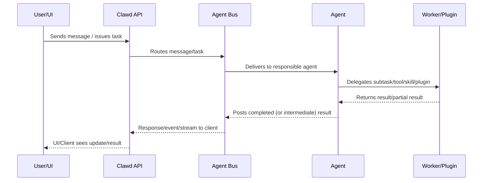

# Clawd Architecture & Agentic Workflow

This document provides an in-depth overview of the architecture of the Clawd project and an end-to-end walkthrough of its agentic workflows—how tasks flow through the various components, including message buses, agents, plugins, workers, and external integrations.

---

## 1. System Overview

Clawd is a modular autonomous agent platform built around the following principles:
- **Extensible by plugins** (for agent logic, tools, message buses, UI, storage, etc.)
- **Composable agents** (primary agents can spawn/pluralize sub-agents)
- **Multi-modal** (works with chat UIs, code tools, APIs, and CLIs)
- **Secure-by-default** (sandboxed tool execution, plugin isolation, secrets control)


---

## 2. High-Level Architecture Diagram

```mermaid
graph TD
    User[User / UI / Client]
    ChatUI[Chat UI]
    API[REST/WebSocket API]
    AgentBus[Agent Bus / Message Broker]
    AgentSys[Agent System]
    Plugins[Plugins/Tools]
    Worker[Worker Threads]
    Ext[External Services]
    Storage[File/DB/Memory Storage]

    User --> ChatUI
    ChatUI --> API
    API --> AgentBus
    AgentBus --> AgentSys
    AgentSys --> Plugins
    AgentSys --> Worker
    AgentSys --> Ext
    Plugins --> Storage
    Worker --> Storage

```



---

## 3. Core Components

### **A. Agent System**
- Coordinates agents, workers, session management, and workflow orchestration.
- Supports both single and multi-agent (e.g., sub-agent) workflows.

### **B. Plugin Layer**
- Plugins define the core extensibility, e.g. tools (filesystem, bash, code, web), custom agents, skills, UI extensions, message queues/buses, integrations, memory, etc.

### **C. Message Bus (Agent Bus)**
- Decouples message/command/event routing from the agents themselves.
- Supports plugin-based bus adapters (in-memory, chat, API, webhooks, etc.)

### **D. Worker Pool**
- Manages background/long-running tasks and isolates risky execution.
- Each worker/agent can run in its own process/sandbox.

### **E. Storage & Memory**
- Unified API for persistent and ephemeral agent memory.
- Supports pluggable storage backends (file, database, chat history, etc.)

---

## 4. Agentic Workflow (End-to-End)



---

## 5. Directory Structure (Key Locations)

- `/src/` — Core source code: agent engine, main integrations.
- `/plugins/` — Plugins: agents, tools, buses, skills, extensions.
- `/docs/` — Documentation (this doc, skill/plugin guides, workflows...)
- `/dist/` — Production output
- `/scripts/` — Utilities for setup, testing, build
- `/packages/` — Optional monorepo submodules (UI, SDK, shared lib, etc.)
- `README.md` — Project intro, quickstart, links

---

## 6. Installation & Usage

### **Installation**
- Requires [Bun](https://bun.sh), Node.js, and all project deps (`bun install`)
- For plugin dev: see `/plugins` and `/src`
- UI: install/bundle via `/packages` as needed

### **Usage**
- Main entry (launch server): `bun run src/index.ts`
- Run with UI: start both API/server and UI app
- Extend with new agent/plugin: drop code to `/plugins`, update manifest

---

## 7. Security & Extensibility

- All dangerous tools (e.g., bash) are sandboxed & controlled by strict policy
- Plugins are loaded dynamically and can be enabled/disabled per deployment
- Agent workflows can spawn, chain, or parallelize sub-agents as needed

---

## 8. Multimodal Tools Architecture

### Overview

Claw'd supports multimodal AI capabilities through four MCP tools. All tools are implemented as pure TypeScript with no external script dependencies — only native system tools (ffmpeg, ffprobe) are used for video processing.

### Provider Priority

Image tools use a dual-provider architecture with automatic failover:

| Priority | Provider | Config Key | Use Case |
|----------|----------|------------|----------|
| **Primary** | CPA (CLIProxyAPI) | `providers.cpa` | OpenAI-compatible proxy to Gemini/Antigravity |
| **Fallback** | Direct Gemini API | `env.GEMINI_API_KEY` | Native Gemini REST API (quota-tracked) |

If CPA is configured (`providers.cpa` in `~/.clawd/config.json`), it is used first. If CPA fails, the system falls back to direct Gemini API (if `GEMINI_API_KEY` is configured). If neither is configured, tools return a clear error.

### Models

| Purpose | CPA Model | Direct Gemini Model | Notes |
|---------|-----------|---------------------|-------|
| Vision/analysis | `gemini-3-flash` (or `models.flash`) | `gemini-2.5-flash` | Text analysis of images/video |
| Image generation | `gemini-3.1-flash-image` (or `models.flash-image`) | `gemini-3.1-flash-image-preview` | Image gen with text prompt |
| Image editing | `gemini-3.1-flash-image` (or `models.flash-image`) | `gemini-3.1-flash-image-preview` | Source image read internally by tool |

### Tools

| Tool | Purpose | API | Timeout |
|------|---------|-----|---------|
| `read_image` | Analyze images using Gemini vision | `generateContent` | 120s |
| `create_image` | Generate images from text prompts | `generateContent` (IMAGE mode) | 180s |
| `edit_image` | Edit existing images with AI | `generateContent` (IMAGE mode) | 180s |
| `read_video` | Analyze videos (native + frame fallback) | `generateContent` + Files API | 300s |

`create_image` supports `image_size` ("512px", "1K", "2K", "4K") and expanded `aspect_ratio` options including "1:4", "4:1", "1:8", "8:1". Input validation rejects invalid values before calling the API.

### Architecture

```
┌──────────────────────────────────────────────────┐
│ src/server/mcp.ts                                │
│  ├─ Tool Definitions (MCP_TOOLS array)           │
│  └─ Case Handlers (executeToolCall switch)       │
│       ├─ read_image → analyzeImage()             │
│       ├─ create_image → generateImage() → DB     │
│       ├─ edit_image → editImage() → DB           │
│       └─ read_video → analyzeVideo()             │
├──────────────────────────────────────────────────┤
│ src/server/multimodal.ts                         │
│  ├─ Gemini REST API client (pure fetch)          │
│  ├─ Files API upload (resumable, with polling)   │
│  ├─ Path security (realpathSync, symlink-safe)   │
│  ├─ ffmpeg/ffprobe subprocess (video frames)     │
│  └─ Response truncation (10K char cap)           │
├──────────────────────────────────────────────────┤
│ src/config-file.ts                               │
│  └─ getEnvVar("GEMINI_API_KEY") → config → env   │
└──────────────────────────────────────────────────┘
```

### Security Model

1. **File ID only**: All tools accept `file_id` (DB lookup), never raw file paths — prevents path traversal
2. **Path safety**: `isPathSafe()` uses `realpathSync()` to resolve symlinks before directory validation
3. **Sandbox awareness**: Respects `--yolo` mode; restricts file access to ATTACHMENTS_DIR + /tmp when sandboxed
4. **Case-insensitive MIME checks**: All mimetype guards use `.toLowerCase().startsWith()` — both in MCP handlers and multimodal functions (defense-in-depth)
5. **Image base64 blocking**: Three handlers hardened — `chat_download_file`, `chat_get_message_files`, `chat_read_file_range` — never return image base64 regardless of arguments
6. **API key sanitization**: Error messages from Gemini API are sanitized to redact API keys before returning to the agent
7. **Upload size cap**: 200MB limit on Files API uploads to prevent OOM
8. **Timeout enforcement**: All fetch() calls use AbortController; subprocesses use manual setTimeout + SIGKILL
9. **Input validation**: `create_image` validates `aspect_ratio` and `image_size` against allowlists before calling the API
10. **Internal image handling**: `edit_image` reads source images internally via file_id → DB → file path → base64 — the agent never sees image content

### Configuration

Add to `~/.clawd/config.json`:

```json
{
  "providers": {
    "cpa": {
      "base_url": "https://your-cpa-endpoint.com/v1",
      "api_key": "your-cpa-api-key",
      "models": {
        "flash-image": "gemini-3.1-flash-image",
        "flash": "gemini-3-flash"
      }
    }
  },
  "env": {
    "GEMINI_API_KEY": "your-gemini-api-key"
  }
}
```

- **CPA provider** (primary): Configure `providers.cpa` with an OpenAI-compatible API endpoint. Model names in `models.flash-image` (image gen/edit) and `models.flash` (vision) are used automatically.
- **Gemini API** (fallback): Configure `env.GEMINI_API_KEY` for direct Gemini REST API access. Used when CPA is unavailable or fails.
- Either or both can be configured. At least one is required for image tools to work.

Environment variables are loaded via `getEnvVar()` which checks config file first, then `process.env` as fallback.

### Video Analysis Flow

```
read_video(file_id)
  │
  ├─ file ≤ 200MB → Upload via Gemini Files API
  │   ├─ Upload fails → Fallback to frame extraction
  │   └─ Upload succeeds → Analyze video
  │       ├─ Success → Return analysis
  │       └─ Analysis fails → Fallback to frame extraction
  │
  └─ file > 200MB → Frame extraction (upload skipped)
      │
      ├─ ffprobe → get duration
      ├─ ffmpeg → extract frames (fps = maxFrames/duration)
      ├─ Gemini → analyze frames as inline images
      └─ Cleanup temp frames directory
```

### Error Handling

All multimodal functions return a consistent result object:

```typescript
{ ok: boolean; result?: string; error?: string }
```

No exceptions are thrown from the public API — all errors are caught and returned as `{ ok: false, error: "..." }`. The MCP handlers serialize these directly as `JSON.stringify(result)`.

API key values are stripped from all error messages via `sanitizeError()` to prevent credential leakage.

### Quota Tracking

Image generation and editing via **Gemini API only** are quota-tracked to prevent unexpected charges. CPA provider calls are NOT quota-limited (the CPA server manages its own rate limits).

| Setting | Value |
|---------|-------|
| **Applies to** | Gemini API calls only (not CPA) |
| **Usage file** | `~/.clawd/usage.json` |
| **Default limit** | 50 images/day |
| **Config key** | `quotas.daily_image_limit` in `~/.clawd/config.json` |
| **Unlimited** | Set limit to `0` to disable tracking |
| **Reset** | Midnight Pacific Time (matches Google's quota cycle) |

**Architecture:**
- `checkImageQuota()` runs **before** each Gemini API call only; skipped for CPA calls
- `recordImageGeneration()` runs **after** successful Gemini generation only
- In-memory `_inFlightCount` mitigates TOCTOU race conditions across concurrent Gemini requests
- Atomic writes (write-to-temp + rename) prevent file corruption on crash
- `getImageQuotaStatus()` returns `{ used, limit, remaining }` — included in all `create_image` and `edit_image` responses for informational purposes
- `remaining` is `null` when tracking is disabled (limit=0)
- Vision analysis (`read_image`, `read_video`) does NOT count toward quota

**Config example:**
```json
{
  "quotas": {
    "daily_image_limit": 100
  }
}
```

### Database Integration

Generated images (`create_image`) are auto-registered in the `files` table:

| Column | Value |
|--------|-------|
| `id` | `generateId("F")` → `F-xxxxx` |
| `name` | `generated-{timestamp}.{ext}` |
| `mimetype` | Detected from file extension |
| `size` | `statSync()` after generation |
| `path` | Saved to `ATTACHMENTS_DIR` |
| `uploaded_by` | `"system"` |

File IDs follow the lifecycle: **tool input** (`file_id`) → **DB lookup** (`files` table) → **path validation** (`isPathSafe`) → **API call** (Gemini).

### Limitations

- **Inline size cap**: 20MB for base64 inline images
- **Upload size cap**: 200MB for Files API uploads; larger files use frame extraction
- **Response truncation**: All Gemini output capped at 10,000 characters
- **Temp cleanup**: Frame extraction cleanup failures are silently ignored
- **ffmpeg required**: Video frame extraction requires ffmpeg/ffprobe installed on the system

### Standalone Requirements

- **No Python dependency**: Gemini API called directly via `fetch()` (REST API)
- **No Node.js scripts**: All logic in compiled TypeScript
- **Native tools only**: ffmpeg/ffprobe for video processing (standard system packages)
- **Single binary**: Compiles to `dist/server/clawd-app` via `bun build --compile`

---

## 9. Further Reading
- Consult `README.md` for high-level guide and links
- See `/docs/` for deep dives into specific subsystems and plugin tooling
- In-code docs for plugin/agent extension APIs
