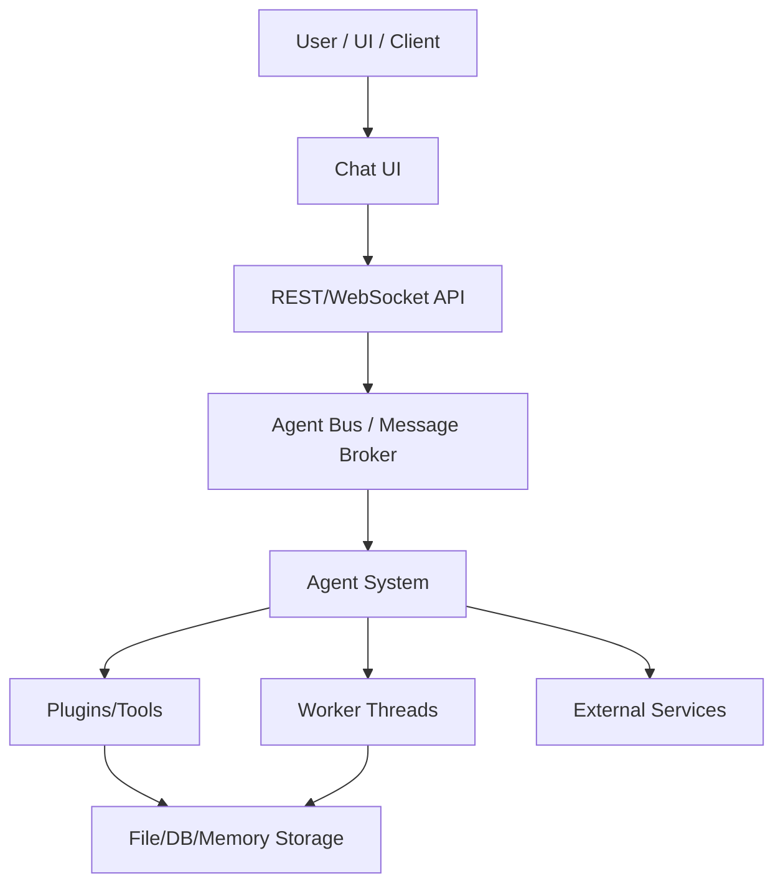
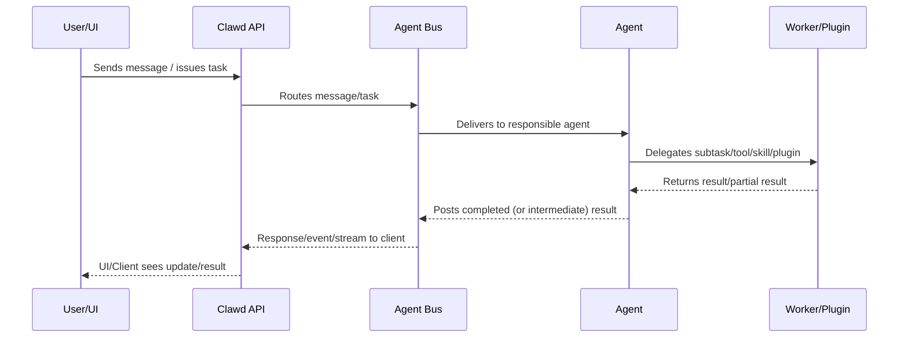

# Clawd Architecture & Agentic Workflow

This document provides an in-depth overview of the architecture of the Clawd project and an end-to-end walkthrough of its agentic workflows—how tasks flow through the various components, including message buses, agents, plugins, workers, and external integrations.

---

## 1. System Overview

Clawd is a modular autonomous agent platform built around the following principles:
- **Extensible by plugins** (for agent logic, tools, message buses, UI, storage, etc.)
- **Composable agents** (primary agents can spawn/pluralize sub-agents)
- **Multi-modal** (works with chat UIs, code tools, APIs, and CLIs)
- **Secure-by-default** (sandboxed tool execution, plugin isolation, secrets control)

---

## 2. High-Level Architecture Diagram

---

## 3. Core Components

### **A. Agent System**
- Coordinates agents, workers, session management, and workflow orchestration.
- Supports both single and multi-agent (e.g., sub-agent) workflows.

### **B. Plugin Layer**
- Plugins define the core extensibility, e.g. tools (filesystem, bash, code, web), custom agents, skills, UI extensions, message queues/buses, integrations, memory, etc.

### **C. Message Bus (Agent Bus)**
- Decouples message/command/event routing from the agents themselves.
- Supports plugin-based bus adapters (in-memory, chat, API, webhooks, etc.)

### **D. Worker Pool**
- Manages background/long-running tasks and isolates risky execution.
- Each worker/agent can run in its own process/sandbox.

### **E. Storage & Memory**
- Unified API for persistent and ephemeral agent memory.
- Supports pluggable storage backends (file, database, chat history, etc.)

---

## 4. Agentic Workflow (End-to-End)

---

## 5. Directory Structure (Key Locations)

- `/src/` — Core source code: agent engine, main integrations.
- `/plugins/` — Plugins: agents, tools, buses, skills, extensions.
- `/docs/` — Documentation (this doc, skill/plugin guides, workflows...)
- `/dist/` — Production output
- `/scripts/` — Utilities for setup, testing, build
- `/packages/` — Optional monorepo submodules (UI, SDK, shared lib, etc.)
- `README.md` — Project intro, quickstart, links

---

## 6. Installation & Usage

### **Installation**
- Requires [Bun](https://bun.sh), Node.js, and all project deps (`bun install`)
- For plugin dev: see `/plugins` and `/src`
- UI: install/bundle via `/packages` as needed

### **Usage**
- Main entry (launch server): `bun run src/index.ts`
- Run with UI: start both API/server and UI app
- Extend with new agent/plugin: drop code to `/plugins`, update manifest

---

## 7. Security & Extensibility

- All dangerous tools (e.g., bash) are sandboxed & controlled by strict policy
- Plugins are loaded dynamically and can be enabled/disabled per deployment
- Agent workflows can spawn, chain, or parallelize sub-agents as needed

---

## 8. Further Reading
- Consult `README.md` for high-level guide and links
- See `/docs/` for deep dives into specific subsystems and plugin tooling
- In-code docs for plugin/agent extension APIs
