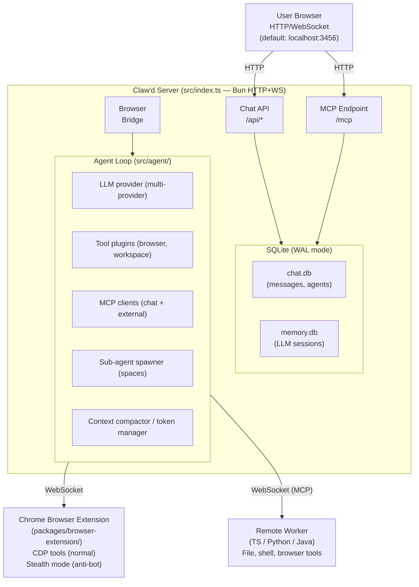
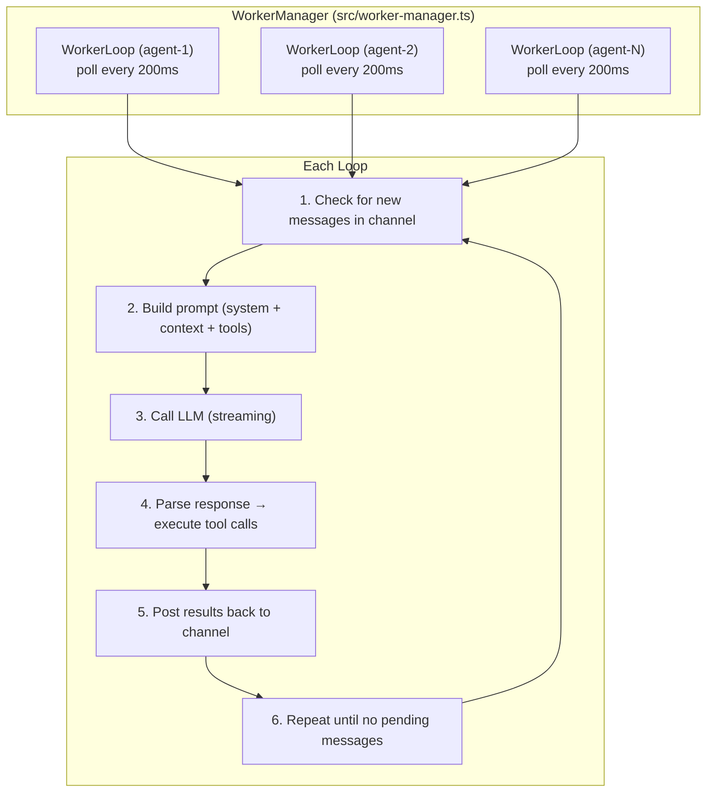
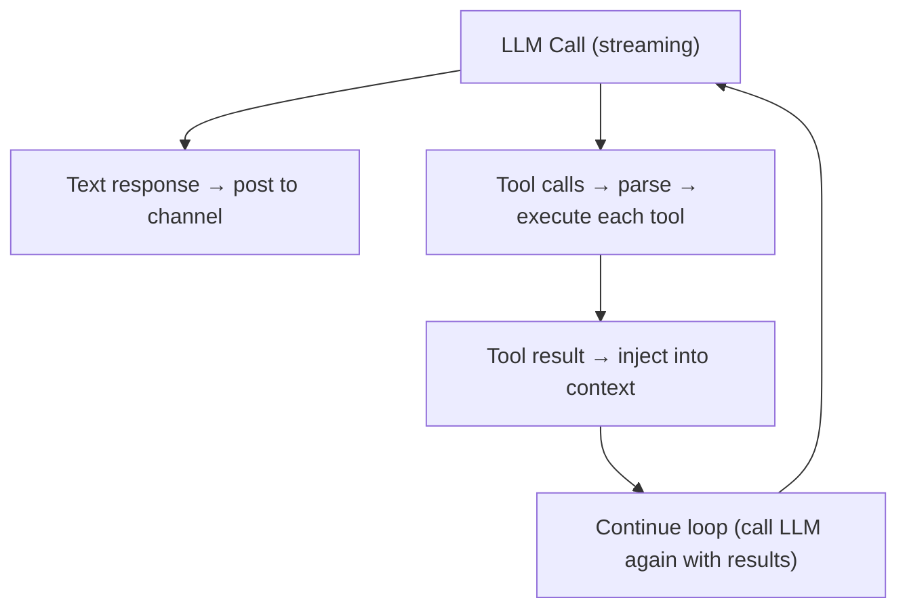
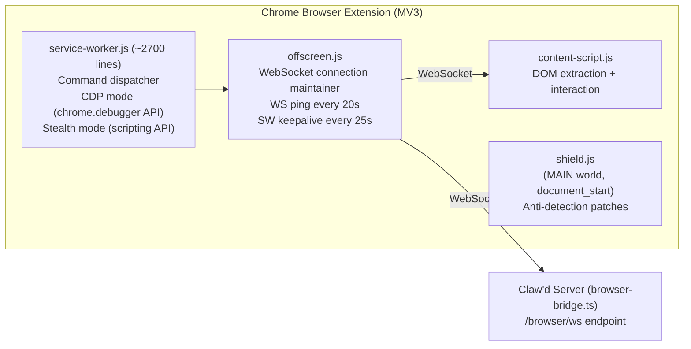
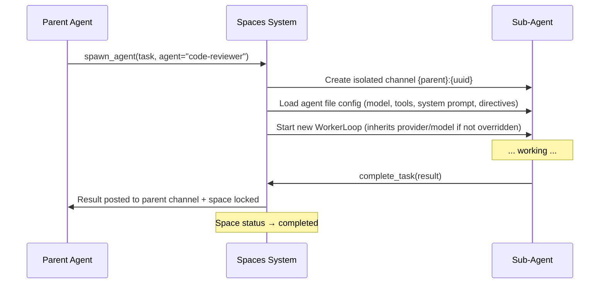
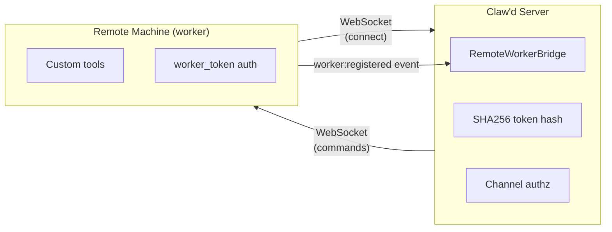
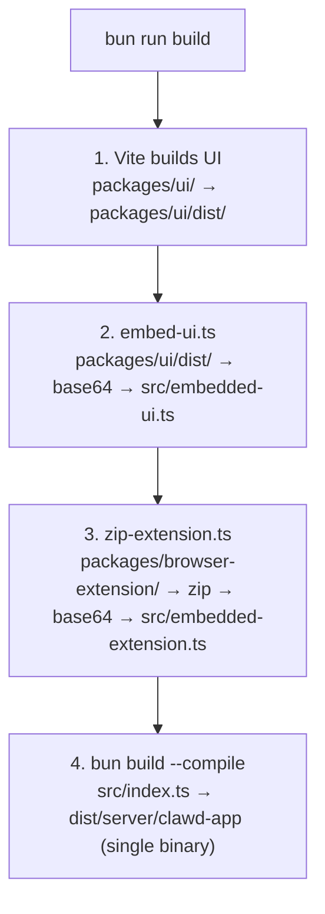

# Claw'd Architecture Reference

> Last updated: 2026-03-28

---

## Table of Contents

1. [System Overview](#1-system-overview)
2. [High-Level Architecture](#2-high-level-architecture)
3. [Directory Layout](#3-directory-layout)
4. [Server Entry Point](#4-server-entry-point)
5. [Database Schema](#5-database-schema)
   - [chat.db — Chat & Agent State](#51-chatdb--chat--agent-state)
   - [memory.db — Agent Session Memory](#52-memorydb--agent-session-memory)
6. [Agent System](#6-agent-system)
   - [Worker Loop](#61-worker-loop)
   - [Agent Class & Reasoning Loop](#62-agent-class--reasoning-loop)
   - [Token Management & Context Compaction](#63-token-management--context-compaction)
   - [Plugin System](#64-plugin-system)
   - [Memory System](#65-memory-system)
   - [Heartbeat Monitor](#66-heartbeat-monitor)
   - [Stream Timeouts (State-Based)](#67-stream-timeouts-state-based)
   - [Model Tiering & Tool Filtering](#68-model-tiering--tool-filtering)
7. [Performance Optimizations](#7-performance-optimizations)
   - [Database Optimizations](#71-database-optimizations)
   - [Query Optimizations](#72-query-optimizations)
   - [Streaming & WebSocket Optimizations](#73-streaming--websocket-optimizations)
   - [Agent Loop Optimizations](#74-agent-loop-optimizations)
   - [Memory Architecture Improvements](#75-memory-architecture-improvements)
8. [Browser Extension](#8-browser-extension)
   - [Architecture Overview](#71-architecture-overview)
   - [Normal Mode (CDP)](#72-normal-mode-cdp)
   - [Stealth Mode (Anti-Bot)](#73-stealth-mode-anti-bot)
   - [Anti-Detection Shield](#74-anti-detection-shield)
   - [Distribution](#75-distribution)
   - [Artifact Rendering Pipeline](#76-artifact-rendering-pipeline)
9. [Sub-Agent System (Spaces & Claude Agent SDK)](#9-sub-agent-system-spaces)
   - [Space Lifecycle](#91-space-lifecycle)
   - [Claude Agent SDK](#92-claude-agent-sdk)
   - [Scheduler Integration](#93-scheduler-integration)
10. [Sandbox Security](#10-sandbox-security)
   - [Linux (bubblewrap)](#101-linux-bubblewrap)
   - [macOS (sandbox-exec)](#102-macos-sandbox-exec)
   - [Access Policy](#103-access-policy)
11. [Remote Worker Bridge](#11-remote-worker-bridge)
12. [WebSocket Events](#12-websocket-events)
13. [API Reference](#13-api-reference)
    - [Chat APIs](#121-chat-apis)
    - [File APIs](#122-file-apis)
    - [Reaction APIs](#123-reaction-apis)
    - [Agent Streaming APIs](#124-agent-streaming-apis)
    - [Agent Management APIs](#125-agent-management-apis)
    - [App Management APIs](#126-app-management-apis)
    - [Project Browser APIs](#127-project-browser-apis)
    - [Analytics APIs](#128-analytics-apis)
    - [Task Management APIs](#129-task-management-apis)
    - [Special Endpoints](#1210-special-endpoints)
13. [LLM Provider System](#13-llm-provider-system)
14. [Chat UI](#14-chat-ui)
15. [Build System](#15-build-system)
16. [Docker Deployment](#16-docker-deployment)
17. [Configuration Reference](#17-configuration-reference)
    - [config.json Schema](#171-configjson-schema)
    - [System Files & Directories](#172-system-files--directories)

---

## 1. System Overview

Claw'd is an open-source agentic chat platform where AI agents operate autonomously,
communicating with users through a real-time collaborative chat UI. Agents can:

- Communicate with users and each other through real-time collaborative chat
- Execute code, browse the web, and interact with files using tool plugins
- Control a Chrome browser remotely via the browser extension (CDP or stealth mode)
- Analyze and generate images using multi-provider vision models
- Create and manage scheduled tasks (cron, interval, one-shot)
- Delegate work to sub-agents via the Spaces system for parallel execution
- Persist long-term memories, knowledge chunks, and session context across restarts

**Core design principles:**

| Principle | Description |
|---|---|
| **Single binary deployment** | Compiles to `dist/server/clawd-app` with embedded UI + browser extension |
| **Provider-agnostic** | Supports Copilot, OpenAI, Anthropic, Ollama, Minimax |
| **Plugin-first agents** | All agent capabilities are expressed through the ToolPlugin/Plugin interfaces |
| **Secure by default** | Sandboxed tool execution (bubblewrap/sandbox-exec), path validation, auth tokens |
| **Real-time collaboration** | WebSocket-driven UI with streaming tokens, tool calls, and read receipts |
| **Multi-agent** | Multiple agents per channel, sub-agent spawning, remote worker bridge |

---

## 2. High-Level Architecture



### Data Flow Summary

1. **User → Server**: HTTP requests hit `/api/*` routes; WebSocket at `/ws` for real-time events
2. **Server → Database**: Two SQLite databases — `chat.db` for chat state, `memory.db` for LLM sessions
3. **Server → Agent Loop**: Worker manager starts one `WorkerLoop` per agent, polling every 200ms
4. **Agent → LLM**: Streaming calls to configured provider (Copilot, OpenAI, Anthropic, Ollama, Minimax)
5. **Agent → Tools**: Plugin system executes tool calls; results flow back into the LLM loop
6. **Agent → Browser**: WebSocket bridge to Chrome extension for remote browser automation
7. **Agent → Sub-agents**: Spaces system spawns isolated sub-agent channels for parallel work
8. **Agent → Remote Worker**: WebSocket MCP bridge extends agent tools to external machines (TS/Python/Java workers)

---

## 3. Directory Layout

```
clawd/
├── src/                        # Main server + agent system
│   ├── index.ts                # Server entry point (HTTP/WS/routes)
│   ├── config.ts               # CLI config parser
│   ├── config-file.ts          # ~/.clawd/config.json loader
│   ├── worker-loop.ts          # Per-agent polling loop
│   ├── worker-manager.ts       # Multi-agent orchestrator
│   ├── server/
│   │   ├── database.ts         # chat.db lazy singleton + Proxy; _resetForTesting()
│   │   ├── websocket.ts        # WebSocket broadcasting
│   │   ├── http-helpers.ts     # Shared HTTP helpers (json(), requireAuth(), etc.)
│   │   ├── validate.ts         # validateBody<T>(schema, body) — Zod request validation
│   │   ├── routes/             # API route handlers (agents.ts, analytics.ts, …)
│   │   └── browser-bridge.ts   # Browser extension WS bridge
│   ├── agent/
│   │   ├── agent.ts            # Main Agent class + reasoning loop
│   │   ├── api/                # LLM provider clients, key pool, factory
│   │   ├── tools/              # Tool barrel (tools.ts) + 7 domain modules
│   │   │   ├── tools.ts        # 201-line barrel — re-exports full API
│   │   │   ├── registry.ts     # ToolDefinition registry + executeTool
│   │   │   ├── file-tools.ts   # File read/write/glob/grep
│   │   │   ├── shell-tools.ts  # Bash/exec tools
│   │   │   ├── git-tools.ts    # Git operations
│   │   │   ├── chat-tools.ts   # Chat send/upload/list
│   │   │   ├── web-tools.ts    # Web fetch/search
│   │   │   └── memory-tools.ts # Memory recall/save
│   │   ├── plugins/            # All plugins (chat, browser, workspace, tunnel, etc.)
│   │   ├── session/            # Session manager, checkpoints, summarizer
│   │   ├── memory/             # memory.ts, knowledge-base.ts, agent-memory.ts
│   │   ├── mcp/                # MCP client connections
│   │   └── utils/              # sandbox.ts, agent-context.ts
│   ├── db/                     # Unified migration system
│   │   ├── migrations.ts       # runMigrations(db, migrations, strategy)
│   │   └── migrations/         # Per-DB migration files
│   │       ├── chat-migrations.ts
│   │       ├── memory-migrations.ts
│   │       ├── scheduler-migrations.ts
│   │       ├── kanban-migrations.ts
│   │       └── skills-cache-migrations.ts
│   ├── spaces/                 # Sub-agent system
│   │   ├── manager.ts          # Space lifecycle management
│   │   ├── worker.ts           # Space worker orchestrator
│   │   ├── spawn-plugin.ts     # spawn_agent tool
│   │   ├── plugin.ts           # complete_task, get_environment
│   │   └── db.ts               # spaces table schema
│   ├── scheduler/              # Scheduled jobs (cron, interval, once)
│   │   ├── manager.ts          # Scheduler tick loop
│   │   ├── runner.ts           # Job executor (creates sub-spaces)
│   │   └── parse-schedule.ts   # Natural language schedule parser
│   └── api/                    # Agent management, articles, MCP servers
├── packages/
│   ├── ui/                     # React SPA (Vite + TypeScript)
│   │   └── src/
│   │       ├── App.tsx         # Main app, WS handling, state
│   │       ├── MessageList.tsx # Messages + StreamOutputDialog
│   │       └── styles.css      # All styles
│   └── browser-extension/      # Chrome MV3 extension
│       ├── manifest.json       # Extension manifest
│       └── src/
│           ├── service-worker.js # Command dispatcher (~2700 lines)
│           ├── content-script.js # DOM extraction
│           ├── shield.js       # Anti-detection patches
│           └── offscreen.js    # WS connection maintainer
├── scripts/                    # Build utilities
│   ├── embed-ui.ts             # Embeds UI into binary
│   └── zip-extension.ts        # Packs extension into binary
├── docs/                       # Documentation
├── Dockerfile                  # Multi-stage Docker build
└── compose.yaml                # Docker Compose deployment
```

### Key Files Quick Reference

| File | Purpose |
|------|---------|
| `src/index.ts` | HTTP server, WebSocket handler, route registration |
| `src/config.ts` | CLI argument parser (--port, --host, --yolo, --debug) |
| `src/config-file.ts` | Loads and validates `~/.clawd/config.json` |
| `src/worker-loop.ts` | Per-agent polling loop (200ms interval) |
| `src/worker-manager.ts` | Manages lifecycle of all agent WorkerLoop instances |
| `src/server/database.ts` | chat.db lazy singleton (Proxy), schema, prepared statements; `_resetForTesting()` |
| `src/server/http-helpers.ts` | Shared HTTP utilities used across route handlers |
| `src/server/validate.ts` | Zod-backed `validateBody<T>()` for HTTP request body validation |
| `src/db/migrations.ts` | `runMigrations(db, migrations, strategy)` — unified migration runner (PRAGMA user_version) |
| `src/server/websocket.ts` | WebSocket connection tracking, message broadcasting |
| `src/server/browser-bridge.ts` | WebSocket bridge between agents and browser extension |
| `src/agent/agent.ts` | Core Agent class — reasoning loop, tool dispatch |
| `src/spaces/manager.ts` | Sub-agent space creation, lifecycle, cleanup |
| `src/scheduler/manager.ts` | Cron/interval/once job scheduling and execution |

---

## 4. Server Entry Point

`src/index.ts` runs a single Bun HTTP + WebSocket server (default: `0.0.0.0:3456`). The
file was refactored from ~2557 → ~1905 lines by extracting route handlers into dedicated
modules under `src/server/routes/` (e.g., `agents.ts`, `analytics.ts`) with shared helpers
in `src/server/http-helpers.ts`.

### Request Routing

All API requests are routed through the HTTP handler. The server serves three primary
functions:

1. **REST API** (`/api/*`) — Chat, agent management, files, scheduler, analytics
2. **MCP Endpoint** (`/mcp`) — Model Context Protocol SSE transport for external clients; requires auth check on all `/mcp` prefixed paths
3. **Static Assets** (`/*`) — Embedded React SPA served as fallback for all non-API routes

### WebSocket Connections

| Upgrade Path | Purpose |
|-------------|---------|
| `/ws` | Real-time chat events (messages, reactions, agent streaming, tool calls) |
| `/browser/ws` | Browser extension bridge (command dispatch + results) |

---

## 5. Database Schema

Claw'd uses two separate SQLite databases, both in WAL mode for concurrent read/write.

### 5.1 chat.db — Chat & Agent State

**Location**: `~/.clawd/data/chat.db`

This is the primary database for all chat, agent, and scheduling state.

#### channels

| Column | Type | Description |
|--------|------|-------------|
| `id` | TEXT PK | Channel identifier |
| `name` | TEXT | Display name |
| `created_by` | TEXT | Creator user/agent ID |

#### messages

| Column | Type | Description |
|--------|------|-------------|
| `ts` | TEXT PK | Timestamp (message ID) |
| `channel` | TEXT | Channel the message belongs to |
| `user` | TEXT | Sender (user or agent ID) |
| `text` | TEXT | Message content (Markdown) |
| `agent_id` | TEXT | Agent that generated this message (nullable) |
| `subspace_json` | TEXT | Sub-agent space metadata (nullable) |
| `tool_result_json` | TEXT | Tool execution result (nullable) |

#### files

| Column | Type | Description |
|--------|------|-------------|
| `id` | TEXT PK | File identifier |
| `name` | TEXT | Storage filename |
| `mimetype` | TEXT | MIME type |
| `size` | INTEGER | File size in bytes |
| `path` | TEXT | File storage path |
| `message_ts` | TEXT | Associated message timestamp |
| `uploaded_by` | TEXT | User who uploaded the file |
| `created_at` | TEXT | Creation timestamp |
| `public` | INTEGER | Whether the file is publicly accessible |

#### agents

| Column | Type | Description |
|--------|------|-------------|
| `id` | TEXT PK | Agent identifier |
| `channel` | TEXT | Home channel |
| `avatar_color` | TEXT | Display color |
| `display_name` | TEXT | Human-readable name |
| `is_worker` | INTEGER | Whether this is a worker agent |
| `is_sleeping` | INTEGER | Whether the agent is hibernating |

#### channel_agents

| Column | Type | Description |
|--------|------|-------------|
| `channel` | TEXT | Channel ID |
| `agent_id` | TEXT | Agent ID |
| `provider` | TEXT | LLM provider for this assignment |
| `model` | TEXT | LLM model for this assignment |
| `project` | TEXT | Project/workspace path |
| `worker_token` | TEXT | Remote worker auth token (nullable) |

#### agent_seen

| Column | Type | Description |
|--------|------|-------------|
| `agent_id` | TEXT | Agent ID |
| `channel` | TEXT | Channel ID |
| `last_seen_ts` | TEXT | Last message the agent observed |
| `last_processed_ts` | TEXT | Last message the agent acted on |
| `last_poll_ts` | TEXT | Last poll timestamp |

#### agent_status

| Column | Type | Description |
|--------|------|-------------|
| `agent_id` | TEXT | Agent ID |
| `channel` | TEXT | Channel ID |
| `status` | TEXT | Current status |
| `hibernate_until` | TEXT | Wake-up timestamp (nullable) |

#### summaries

| Column | Type | Description |
|--------|------|-------------|
| `channel` | TEXT | Channel ID |
| `agent_id` | TEXT | Agent that created the summary |
| `summary` | TEXT | Compressed context summary |

#### spaces

| Column | Type | Description |
|--------|------|-------------|
| `id` | TEXT PK | Space identifier |
| `channel` | TEXT | Parent channel |
| `space_channel` | TEXT | Isolated sub-channel (format: `{parent}:{uuid}`) |
| `title` | TEXT | Space task description |
| `status` | TEXT | Status (active, completed, failed, timed_out) |

#### Other Tables

| Table | Purpose |
|-------|---------|
| `articles` | Knowledge articles |
| `copilot_calls` | API call analytics and tracking |

### 5.1b kanban.db — Task & Plan Management

**Location**: `~/.clawd/data/kanban.db`

| Table | Purpose |
|-------|---------|
| `tasks` | Channel-scoped tasks (status, assignee, priority, due dates) |
| `plans` | Plan documents with phases |
| `phases` | Plan phases/milestones |
| `plan_tasks` | Tasks linked to plan phases |

### 5.1c scheduler.db — Scheduler State

**Location**: `~/.clawd/data/scheduler.db`

#### scheduled_jobs

| Column | Type | Description |
|--------|------|-------------|
| `id` | TEXT PK | Job identifier |
| `channel` | TEXT | Channel the job belongs to |
| `title` | TEXT | Job description |
| `type` | TEXT | Schedule type: `once`, `interval`, `cron`, `reminder`, or `tool_call` |
| `cron_expr` | TEXT | Cron expression (for cron type) |

### 5.2 memory.db — Agent Session Memory

**Location**: `~/.clawd/memory.db`

This database stores all LLM session context, knowledge retrieval data, and long-term
agent memories.

#### sessions

| Column | Type | Description |
|--------|------|-------------|
| `id` | TEXT PK | Session identifier |
| `name` | TEXT | Session name (format: `{channel}-{agentId}`) |
| `model` | TEXT | LLM model used |
| `created_at` | INTEGER | Creation timestamp |
| `updated_at` | INTEGER | Last update timestamp |

#### messages

| Column | Type | Description |
|--------|------|-------------|
| `session_id` | TEXT | Foreign key to sessions |
| `role` | TEXT | Message role (system, user, assistant, tool) |
| `content` | TEXT | Message content |
| `tool_calls` | TEXT | JSON-encoded tool call array (nullable) |
| `tool_call_id` | TEXT | Tool call ID for tool results (nullable) |

#### messages_fts

FTS5 full-text search index on `messages.content` for fast session search.

#### knowledge

| Column | Type | Description |
|--------|------|-------------|
| `id` | INTEGER PK | Chunk identifier |
| `session_id` | TEXT | Session the chunk belongs to |
| `source_id` | TEXT | Source identifier |
| `tool_name` | TEXT | Tool that produced this chunk |
| `chunk_index` | INTEGER | Index of this chunk within the source |
| `content` | TEXT | Tool output text chunk for retrieval |
| `created_at` | TEXT | Creation timestamp |

#### knowledge_fts

FTS5 full-text search index on `knowledge.content`.

#### agent_memories

| Column | Type | Description |
|--------|------|-------------|
| `agent_id` | TEXT | Agent that owns this memory |
| `content` | TEXT | Long-term fact, preference, or decision |
| `channel` | TEXT | Channel context for this memory |
| `category` | TEXT | Memory category |
| `source` | TEXT | How this memory was created |
| `access_count` | INTEGER | Number of times this memory was retrieved |
| `last_accessed` | TEXT | Last retrieval timestamp |
| `created_at` | TEXT | Creation timestamp |
| `updated_at` | TEXT | Last update timestamp |

#### agent_memories_fts

FTS5 full-text search index on `agent_memories.content`.

---

## 5.3 Migration System

**File**: `src/db/migrations.ts` (and `src/db/migrations/`)

All five databases use a unified migration runner based on `PRAGMA user_version`:

```typescript
runMigrations(db, migrations, strategy?)
```

- **`versioned`** (default) — runs only migrations with `version > PRAGMA user_version`, then bumps the version. Safe for production data.
- **`recreate-on-mismatch`** — for cache-style DBs (e.g. `skills-cache.db`): if current version < target, drops all tables and re-runs from scratch.

Each migration is a `{ version, description, up(db) }` object. Migrations run atomically inside `db.transaction()` so a partial migration never leaves the DB corrupt.

**Per-DB migration files:**

| File | Database |
|------|---------|
| `src/db/migrations/chat-migrations.ts` | chat.db |
| `src/db/migrations/memory-migrations.ts` | memory.db |
| `src/db/migrations/scheduler-migrations.ts` | scheduler.db |
| `src/db/migrations/kanban-migrations.ts` | kanban.db |
| `src/db/migrations/skills-cache-migrations.ts` | skills-cache.db |

---

## 6. Agent System

### 6.1 Worker Loop

**File**: `src/worker-loop.ts`

Each agent runs its own `WorkerLoop` instance, managed by `WorkerManager`:



**Key behaviors:**

- **Poll interval**: 200ms between checks for new messages
- **Continuation**: If the LLM returns tool calls, results are injected and the loop continues
- **Interrupts**: New user messages can interrupt an in-progress agent turn
- **Retry**: Transient LLM failures trigger automatic retry with exponential backoff

### 6.2 Agent Class & Reasoning Loop

**File**: `src/agent/agent.ts`

The `Agent` class implements the core reasoning loop:



Each iteration:

1. **Build messages array**: system prompt + conversation history + tool definitions
2. **Stream LLM response**: tokens broadcast via WebSocket as `agent_token` events
3. **Parse tool calls**: Extract function name + arguments from the response
4. **Execute tools**: Run through plugin system with `beforeExecute` / `afterExecute` hooks; read-only tools run in parallel via `Promise.all`; write tools run sequentially
5. **Inject results**: Tool outputs added as `tool` role messages, reassembled in original LLM call order
6. **Loop or terminate**: If tool calls present, repeat; otherwise, post final text

#### Parallel Tool Execution

`ToolDefinition` has an optional `readOnly?: boolean` flag. When set to `true`, the tool is safe to run concurrently. At execution time:

- All `readOnly=true` tools from a single LLM response execute via `Promise.all` in one batch
- Write tools (no flag or `readOnly=false`) execute sequentially after all read-only batches
- Results are reassembled in the original order before injection into context
- Configurable via `parallelTools` in config (default: `true`); set to `false` to force sequential

**16 built-in tools** are marked `readOnly: true`: file view/glob/grep, web fetch/search, today, get_environment, list_agents, and several memory-read tools.

#### Dynamic System Prompt Builder

**File**: `src/agent/prompt/builder.ts`

System prompts are dynamically assembled from 12 conditional sections based on agent configuration and environment:

| Section | Condition | Token Impact |
|---------|-----------|--------------|
| **Identity** | Always | ~150 tokens |
| **Environment** | Always | ~50 tokens |
| **Tool Usage** | Always | ~100 tokens |
| **Output Efficiency** | Always | ~80 tokens |
| **Safety** | Always | ~100 tokens |
| **Chat Communication** | Main agents only | ~100 tokens |
| **Git Rules** | If git tools available | ~80 tokens |
| **Sub-Agent Guidance** | If spawn_agent available | ~120 tokens |
| **Task Management** | If task tools available | ~40 tokens |
| **Artifacts** | Main agents only | ~60 tokens |
| **Browser Tools** | If browser enabled | ~50 tokens |
| **Context Awareness** | Always | ~40 tokens |
| **Sub-Agent Instructions** | Sub-agents only | ~80 tokens |

**Token budget:**
- **Main agents**: ~1000-1200 tokens (all relevant sections)
- **Sub-agents**: ~600-800 tokens (stripped to essentials, no chat/artifacts)

### 6.3 Token Management & Context Compaction

The agent maintains a token budget with dynamic thresholds (contextMode=true) or legacy fixed values:

| Level | Dynamic | Legacy | Action |
|-------|---------|--------|--------|
| **Normal** | <50% effective | <32K | Full session history kept |
| **Warning** | 50-70% | 32-50K | Soft compaction begins |
| **Critical** | 70-85% | 50-70K | Aggressive pruning + summarization |
| **Emergency** | >85% | >70K | Full LLM-generated summary, reset |

**Smart message scoring** (from `message-scoring.ts`):
- **Base weights**: system (100), user (90), tool_error (80), tool_success (55), tool_calls (70), assistant_text (50)
- **Recency bonus**: Half-life ~28 messages
- **Reference bonus**: Messages referenced by later messages (+10)
- **3-stage lifecycle**: FULL (>60) → COMPRESSED (30-60) → DROPPED (<30)
- **Anchor messages**: Task definitions, unresolved errors always preserved
- **Atomic grouping**: Tool calls paired with their results

**Full reset trigger**: When tokens exceed 95% of raw model limit (safety margin). Full reset uses a two-phase approach: (1) aggressive compaction keeping last 15 messages, (2) only if still over critical threshold, full session reset with LLM-generated summary (4096 max output tokens, model-aware input budget).

**Hybrid history**: Last 20 messages kept in full; older messages stored compact form for replay.

**Heartbeat handling**: `[HEARTBEAT]` and `<agent_signal>` messages dropped automatically during compaction, never persisted.

### 6.4 Plugin System

Agents are extended through two plugin interfaces:

#### ToolPlugin Interface

```typescript
interface ToolPlugin {
  getTools(): ToolDefinition[]      // Register available tools
  beforeExecute?(call): boolean     // Pre-execution hook (can block)
  afterExecute?(call, result): void // Post-execution hook
}
```

#### Plugin Interface

```typescript
interface Plugin {
  onUserMessage?(message): void       // React to user messages
  onToolCall?(call): void             // React to tool executions
  getSystemContext?(): string          // Inject into system prompt
  // ... additional lifecycle hooks
}
```

#### Active Plugins

| Plugin | File | Purpose |
|--------|------|---------|
| `browser-plugin` | `plugins/browser-plugin.ts` | Browser automation tools via extension bridge |
| `workspace-plugin` | `plugins/workspace-plugin.ts` | File system and project workspace tools |
| `context-mode-plugin` | `plugins/context-mode-plugin.ts` | Toggle between action and context-only modes |
| `state-persistence-plugin` | `plugins/state-persistence-plugin.ts` | Save/restore agent state across restarts |
| `tunnel-plugin` | `plugins/tunnel-plugin.ts` | Expose local services via tunnels |
| `spawn-agent-spaces` | `spaces/spawn-plugin.ts` | Sub-agent spawning via spaces system |

### 6.5 Memory System

The memory system has three tiers, each serving different retrieval needs:

```mermaid
flowchart LR
    subgraph T1["Tier 1: Session Memory (messages table)"]
        T1A["Full conversation history with LLM"]
        T1B["Subject to compaction at token thresholds"]
        T1C["Checkpointed for recovery"]
    end

    subgraph T2["Tier 2: Knowledge Base (knowledge table)"]
        T2A["FTS5-indexed tool output chunks"]
        T2B["Retrieved by FTS5 keyword matching on demand"]
        T2C["Enables recall of past tool results"]
    end

    subgraph T3["Tier 3: Agent Memory (agent_memories table)"]
        T3A["Long-term facts, preferences, decisions"]
        T3B["FTS5-indexed for search"]
        T3C["Persists across sessions indefinitely"]
    end

    T1 --> T2 --> T3
```



**Tier 1 — Session memory**: The raw conversation with the LLM, stored in `memory.db → messages`.
This is the working memory that gets compacted when token limits are reached.

**Tier 2 — Knowledge base**: When tools return large outputs (file contents, command results,
web pages), the output is chunked and stored in `knowledge` with FTS5 indexing. The
agent can later retrieve relevant chunks via FTS5 keyword matching without re-executing the tool.

**Tier 3 — Agent memory**: Explicit long-term storage of facts ("user prefers dark mode"),
preferences ("always use TypeScript"), and decisions ("we chose PostgreSQL for the DB").
These persist indefinitely and are injected into the system prompt when relevant.

### 6.6 Heartbeat Monitor

**File**: `src/worker-manager.ts`

A background health monitor keeps agents responsive and recovers from stuck states:

**Mechanism:**
- Runs on a configurable interval (default: 30s)
- Tracks agent state: idle vs. active processing
- For idle agents: injects a user-role message wrapped in `<agent_signal>[HEARTBEAT]</agent_signal>` to wake them up
- For stuck agents: cancels processing if exceeding timeout (default: 5 minutes)
- For sub-agent spaces: auto-fails after 10 consecutive heartbeats with no progress (circuit breaker)

**Configuration** (in `config.json`):
```jsonc
"heartbeat": {
  "enabled": true,              // Enable monitor (default: true)
  "intervalMs": 30000,          // Check interval (default: 30000)
  "processingTimeoutMs": 300000, // Cancel stuck agents after 5 min
  "spaceIdleTimeoutMs": 60000   // Sub-agent idle timeout
}
```

**Heartbeat Signal Protocol:**
- `[HEARTBEAT]` is sent as a user-role message wrapped in `<agent_signal>[HEARTBEAT]</agent_signal>`
- Agents read this as a wake signal, not a conversational user message
- Agents check for pending work and continue if found
- No reply needed if idle with no pending work

**WebSocket Events** (all broadcast as `type: "agent_heartbeat"` with `event` sub-field):
- `heartbeat_sent` — Heartbeat injected into idle agent
- `processing_timeout` — Agent cancelled for exceeding processing timeout
- `space_auto_failed` — Sub-agent space failed after max heartbeat attempts

### 6.7 Stream Timeouts (State-Based)

**File**: `src/agent/api/client.ts`

Stream timeouts are state-based (not model-name-based) to handle different phases of LLM processing:

| State | Timeout | Meaning |
|-------|---------|---------|
| **CONNECTING** | 30 seconds | Waiting for HTTP response headers (network/connection issues) |
| **PROCESSING** | 300 seconds | Headers received but no data yet (model thinking, extended reasoning) |
| **STREAMING** | 180 seconds | Active data streaming; timeout if pause between chunks exceeds limit |

**State Transitions:**
1. Request starts in **CONNECTING** state (30s timeout)
2. On first response header → transition to **PROCESSING** (300s timeout)
3. On first data chunk → transition to **STREAMING** (180s timeout)
4. Each data chunk resets the **STREAMING** timer
5. If any timeout exceeded → request cancelled with error

This approach accommodates slow models (Opus, o1, o3) with extended thinking without hardcoding model-specific timeouts.

### 6.8 Model Tiering & Tool Filtering

**Files**: `src/agent/agent.ts` (`getIterationModel`), `src/agent/api/factory.ts`

**Model Tiering** (`getIterationModel` in agent.ts):
- Auto-downgrade to fast model (default `claude-haiku-4.5`) when conditions are met:
  - Past first 2 iterations (warmup always uses full model)
  - No tool results pending delivery
  - Not immediately after compaction
  - User message has no reasoning keywords (explain, analyze, design, etc.)
  - Last 3 iterations were ALL pure tool calls (content < 50 chars)
- Upgrades back to full model when reasoning is needed
- Configurable via `config.fastModel`

**Tool Filtering** (`filterToolsByUsage` in agent.ts):
- After 5-iteration warmup, prune unused built-in tools
- Category-based: if any tool in a category is used, keep all tools in that category
- Always keep: chat tools, system tools, MCP/plugin tools
- Re-expansion trigger: if 2+ consecutive text-only responses, re-expand to full set
- Reduces tool definition tokens by 30-60%

**Prompt Caching:**
- Anthropic `prompt-caching-2024-07-31` beta header enabled
- System prompt marked with `cache_control: { type: "ephemeral" }`
- Reduces input token billing for cached prefix

---

## 7. Performance Optimizations

Recent optimizations across database, query, streaming, and memory systems improve latency, reduce resource usage, and enhance scalability.

### 7.1 Database Optimizations

**SQLite Container-Aware Tuning:**
- Cache size reduced to 8MB (vs 64MB default) for containerized environments
- Minimizes memory footprint in Kubernetes deployments
- Tuned for cloud resource constraints

**Composite Index:**
- Added `(channel, ts DESC)` composite index on `messages` table
- Accelerates message history retrieval by timestamp
- Significantly faster for large channels (1000+ messages)

**Periodic Maintenance:**
- **WAL checkpoint**: Periodic synchronization between WAL log and main database (prevents runaway WAL file growth)
- **Database maintenance**: `PRAGMA optimize` run asynchronously after bulk operations
- **Automatic pruning**: `copilot_calls` table pruned for entries >30 days old
- **Orphan cleanup**: Removes sessions with no agent references

### 7.2 Query Optimizations

**Cached Agent Lookup:**
- `getAgent()` results cached with 2-second TTL
- Prepared statements reused for repeated queries
- Reduces database roundtrips for agent metadata

**Batch Message Operations:**
- `getMessageSeenBy()` batches read tracking queries
- Reduces per-message database calls
- Improves bulk message processing performance

**Response Optimization:**
- Removed JSON pretty-printing in MCP responses
- Guarded `toSlackMessage()` with safe JSON.parse error handling
- Reduces serialization overhead

### 7.3 Streaming & WebSocket Optimizations

**Token Batching:**
- Token emissions coalesced in 50ms batches
- Reduces WebSocket frame overhead
- Smooths streaming performance

**SSE Buffer Fix:**
- Fixed Server-Sent Events buffer handling
- Prevents mid-frame chunking issues
- More reliable streaming delivery

**Consolidated Broadcasting:**
- Merged multiple `agent_poll` WebSocket messages into single broadcast (3→1 messages)
- Reduces network traffic by 66%
- Maintains message ordering guarantees

### 7.4 Agent Loop Optimizations

**Instruction Caching:**
- `loadClawdInstructions()` cached with invalidation on file changes
- Reduces filesystem I/O for system prompt assembly

**File List Caching:**
- `listAgentFiles()` cached with 60-second TTL
- Speeds up tool filtering and validation

**Tool Name Caching:**
- Built-in tool names cached at startup
- Eliminates repeated string lookups

**Content-Based Token Cache:**
- Agent token calculations cached based on message content hash
- Avoids redundant tokenization of identical messages

**Adaptive Interrupt Polling:**
- Polling interval increases dynamically: 500ms → 3s backoff
- Reduces CPU usage for idle agents
- Maintains responsiveness for active agents

**getRecentContext Fix:**
- Fixed O(n²) algorithmic complexity → O(n)
- Significant improvement for agents with large message histories

**Browser Bridge Heartbeat:**
- Heartbeat socket marked with `.unref()` to not keep process alive
- Enables graceful shutdown of idle servers

**Async File Upload:**
- File operations made asynchronous
- Prevents blocking of message processing loop

**FTS5 Optimization:**
- `PRAGMA optimize` run after bulk knowledge base insertions
- Improves full-text search performance

**Context Tracker Map Caps:**
- Memory-bounded context tracking maps prevent unbounded growth
- Automatic eviction of old/cold entries

---

## 8. Browser Extension

The Chrome browser extension is the primary mechanism for agent browser automation. It
connects to the clawd server via WebSocket and executes browser commands on behalf of agents.

### 8.1 Architecture Overview



**Communication flow:**

1. Extension's `offscreen.js` maintains a persistent WebSocket to the server at `/browser/ws`
2. Server sends commands (navigate, click, screenshot, etc.) through the bridge
3. `service-worker.js` dispatches commands to the appropriate handler (CDP or stealth)
4. Results (screenshots, DOM data, success/error) flow back through the WebSocket

**25+ command types** are supported: navigate, screenshot, click, type, execute, scroll,
hover, select, drag, upload, accessibility tree, tab management, and more.

### 8.2 Normal Mode (CDP)

Normal mode uses the **Chrome DevTools Protocol** via `chrome.debugger` API for precise,
full-featured browser control.

**Capabilities:**

| Feature | Implementation |
|---------|----------------|
| Screenshots | CDP `Page.captureScreenshot` — full page or viewport |
| Accessibility tree | CDP `Accessibility.getFullAXTree` — structured page content |
| Click | CDP `Input.dispatchMouseEvent` — precise coordinate clicks |
| Type | CDP `Input.dispatchKeyEvent` — keystroke simulation |
| File upload | CDP `DOM.setFileInputFiles` — programmatic file picker |
| Drag and drop | CDP `Input.dispatchDragEvent` — native drag simulation |
| Touch events | CDP `Input.dispatchTouchEvent` — mobile simulation |
| Device emulation | CDP `Emulation.setDeviceMetricsOverride` — viewport + UA |
| JavaScript execution | CDP `Runtime.evaluate` — arbitrary JS in page context |

**Trade-off**: CDP attaches a debugger to the tab, which is **detectable by anti-bot
systems** (Cloudflare, DataDome, PerimeterX, etc.).

### 8.3 Stealth Mode (Anti-Bot)

Stealth mode uses `chrome.scripting.executeScript()` instead of CDP, making automation
**invisible to anti-bot detection systems**.

**How it works:**

- No debugger attachment — `navigator.webdriver` stays `false`
- `el.click()` produces `isTrusted=true` events (native browser behavior)
- Synthetic events include proper `buttons`, `pointerType`, `view` properties
- React/Angular compatibility via native value setters + `_valueTracker` reset
- Input events dispatched in correct order: `pointerdown → mousedown → pointerup → mouseup → click`

**Available in stealth mode:**

| Feature | Status |
|---------|--------|
| Navigate | ✅ |
| Screenshot | ✅ |
| Click | ✅ (`isTrusted=true`) |
| Type/input | ✅ (native setter + event dispatch) |
| Scroll | ✅ |
| Hover | ✅ |
| JavaScript execution | ✅ |
| Select dropdown | ✅ |
| Tab management | ✅ |

**NOT available in stealth mode:**

| Feature | Reason |
|---------|--------|
| File upload | Requires CDP `DOM.setFileInputFiles` |
| Accessibility tree | Requires CDP `Accessibility.getFullAXTree` |
| Drag and drop | Requires CDP `Input.dispatchDragEvent` |
| Touch events | Requires CDP `Input.dispatchTouchEvent` |
| Device emulation | Requires CDP `Emulation.setDeviceMetricsOverride` |

### 8.4 Anti-Detection Shield

**File**: `packages/browser-extension/src/shield.js`

The shield runs in the **MAIN world** at `document_start` — before any page JavaScript
executes. It patches browser APIs to prevent detection of automation:

| Patch | What It Does |
|-------|--------------|
| `navigator.webdriver` | Forces `false` via property redefinition |
| DevTools detection | Patches `console.clear` as no-op; spoofs `outerHeight`/`outerWidth` |
| `Function.prototype.toString` | Returns original native function strings for patched APIs |
| `performance.now()` timing | Normalizes to prevent timing-based detection fingerprinting |
| `Date.now()` / `Date` constructor | Patches to prevent timing-based detection |
| `requestAnimationFrame` | Patches to prevent frame-timing detection |
| Debugger trap neutralization | Prevents `debugger` statement traps from detecting automation |
| `chrome.csi` / `chrome.loadTimes` | Spoofs Chrome-specific API fingerprints |

### 8.5 Distribution

The browser extension is **not installed from a store**. Instead:

1. `scripts/zip-extension.ts` packs the extension directory into a zip archive
2. The zip is base64-encoded and embedded into `src/embedded-extension.ts`
3. At runtime, the server serves the zip at `/browser/extension`
4. Users download and load it as an unpacked extension in Chrome

---

## 7.6 Artifact Rendering Pipeline

**Files**: `packages/ui/src/artifact-*.tsx`, `packages/ui/src/chart-renderer.tsx`

Agents output structured content using `<artifact>` tags for rich visualization in the UI:

**7 Artifact Types:**

| Type | Rendering | Security |
|------|-----------|----------|
| `html` | Sandboxed iframe | DOMPurify sanitization |
| `react` | Babel + Tailwind sandbox | No direct DOM access |
| `svg` | Inline with sanitization | DOMPurify + rehype-sanitize |
| `chart` | Recharts (line/bar/pie/area/scatter/composed) | No network access |
| `csv` | Sortable HTML table | Escaped content |
| `markdown` | Full markdown + syntax highlighting | rehype-sanitize |
| `code` | Prism syntax highlighting (32+ languages) | Read-only display |

**Sandbox Model:**
- HTML/React run in `<iframe sandbox="allow-scripts">` (no external network, DOM access, or cookie leakage)
- Direct `<iframe>` access isolated from parent page origin
- DOMPurify strips dangerous attributes/scripts before rendering
- rehype-sanitize filters unsafe HTML in markdown

**Rendering Locations:**
- **Inline in message**: chart (Recharts), svg (DOMPurify), code (Prism)
- **Sidebar panel** (click preview card): html, react, csv, markdown

**Chart Format:**
```json
{
  "type": "line",
  "data": [{"month": "Jan", "value": 100}],
  "xKey": "month",
  "series": [{"key": "value", "name": "Series 1"}],
  "title": "Title"
}
```

Max 1000 data points, 10 series per chart.

---

## 9. Sub-Agent System (Spaces)

The Spaces system allows agents to delegate tasks to isolated sub-agents that run in
parallel.

### 9.1 Space Lifecycle



**Key details:**

- **Agent parameter**: Optional `agent="code-reviewer"` loads a specific agent file (system prompt, model, tools, directives). Without it, sub-agent inherits parent's configuration
- **Isolated channel**: Each space gets its own channel (`{parent}:{uuid}`) so conversations don't interfere
- **Inheritance**: Sub-agents inherit the parent's project path, LLM provider, and model (unless overridden by agent file)
- **Concurrency limit**: **5 per channel**, **20 global**
- **Timeout**: Default **300 seconds** (5 minutes); `spawn_agent` overrides to 600 seconds
- **Heartbeat**: Sub-agents automatically get a **5-second heartbeat** interval to stay responsive
- **Context seeding**: Parent can pass `context` parameter to reduce sub-agent cold start
- **Result delivery**: Sub-agent calls `complete_task(result)` which posts the result to the parent channel and locks the space (preventing further messages)
- **Sub-agent naming**: Sub-agents use friendly names with UUID suffix (e.g., "code-reviewer-a1b2c3") and get colored avatars
- **Sub-agent tools**: Limited to `complete_task`, `chat_mark_processed`, `get_environment`, `today` — no `chat_send_message` or other tools

**Parent tools for sub-agents**: `retask_agent` allows re-tasking a completed sub-agent without cold start.

**Space statuses**: `active` → `completed` | `failed` | `timed_out`

### 9.2 Claude Agent SDK

**Files**: `src/spaces/worker.ts`, `src/spaces/manager.ts`

Sub-agents are spawned via `@anthropic-ai/claude-agent-sdk`. The SDK is embedded in the compiled binary (gzip-compressed) and auto-extracted to `~/.clawd/bin/cli.js` on first use.

#### Key Architectural Changes

| Aspect | Previous (Raw Bun.spawn) | Current (SDK) |
|--------|--------------------------|---------------|
| **Binary** | `claude` CLI installed separately | Embedded in clawd binary, auto-extracted |
| **Dependencies** | `claude` + Node.js on PATH | Only `bun` required on PATH |
| **Hooks** | Temp scripts in `/tmp` | Programmatic hooks (PreToolUse, PostToolUse) |
| **Interrupts** | `proc.kill()` signal | AbortController-based cancellation |
| **Session Management** | Manual retry logic | SDK auto-retry on stale sessions |
| **Model Caps** | No restrictions | Sonnet max; opus prohibited |
| **Session Resets** | Manual on provider change | Auto-reset on provider or model change |

#### Smart Wakeup Behavior

When a sub-agent wakes from sleep with >3 accumulated messages, the SDK:
1. Skips old messages and creates a conversation summary
2. Injects summary + recent messages into context
3. Preserves sleep state across agent restarts

#### Session Persistence

- Sleep state maintained across agent lifecycle events
- Tool call IDs normalized to "call_" prefix for cross-provider compatibility
- Stream-error tool calls never persisted (prevents corruption loops)

#### Provider Configuration for Sub-agents

Sub-agents respect the parent's provider configuration but can be overridden per sub-agent:

```typescript
// Parent uses OpenAI
const subAgent = await spawnAgent({
  agent: "code-reviewer",
  provider: "openai",  // Optional override
  model: "gpt-4"       // Optional override
});
```

### 9.3 Scheduler Integration

**Files**: `src/scheduler/manager.ts`, `src/scheduler/runner.ts`, `src/scheduler/parse-schedule.ts`

The scheduler creates and manages recurring or one-time jobs:

| Job Type | Behavior |
|----------|----------|
| `cron` | Runs on a cron schedule (e.g., `0 9 * * 1-5` for weekday 9 AM) |
| `interval` | Runs every N seconds/minutes/hours |
| `once` | Runs once at a specific time |
| Reminder | Posts a message without creating a sub-space |
| Tool call | Executes a tool directly without agent involvement |

**Execution flow:**

1. Scheduler **tick loop** runs every **10 seconds**
2. Checks for jobs whose next run time has passed
3. For agent tasks: creates a **sub-space** with the job's instructions
4. Maximum **3 concurrent jobs** globally
5. Natural language schedule parsing via `parse-schedule.ts` (e.g., "every weekday at 9am")

### 9.4 Claude Code Agent System

**Files**: `src/spaces/worker.ts`, `src/agent/agents/identity.ts`

Claude Code agents integrate with `@anthropic-ai/claude-agent-sdk` for sub-agent spawning via Claw'd's main channel:

#### Identity Injection (4-Layer System)

Sub-agents receive full identity context matching Copilot agents:

1. **Global** (`~/.claude/CLAUDE.md`) — Lowest priority
2. **Project** (`{project}/.claude/CLAUDE.md`)
3. **Agent type config** (`src/agent/agents/config/claude-code.yaml`)
4. **Per-agent identity** (`~/.clawd/agents/{name}.md` or `{project}/.clawd/agents/{name}.md`) — Highest priority

**Auto-refresh**: When any `CLAWD.md` file is modified (mtime check), identity automatically refreshes.

**System prompt injection**: PROJECT ROOT path injected into sub-agent system prompt.

#### Settings Passthrough

SDK receives settings from Claw'd config:
- `skip_co_author` — Don't append Co-Authored-By trailers
- `attribution` — Include "Generated with [Claude Code](..." attribution
- `permissions` — Tool access restrictions

#### Custom Providers

Support for custom claude-code providers (e.g., `"claude-code-2"` with type `"claude-code"`):
- Explicit type field recognized
- Custom providers without type auto-inferred
- Listed in agents dialog

#### Sub-Agent Capabilities

- **Human interrupts**: Poll main channel space for human messages; abort + resume with human input
- **Result delivery**: Result messages no longer truncated at 10K chars (full delivery)
- **Error handling**: Timeout, crash, or exit-without-complete_task posted to main channel
- **Retry strategy**: Auto-retry on 500/server errors (up to 2 retries with backoff)
- **Thinking blocks**: Auto-recovery from corrupted thinking block signatures

#### Bug Fixes (March 2026)

| Issue | Fix | Impact |
|-------|-----|--------|
| False "error result: success" | Check subtype vs is_error flag | Proper error detection |
| Stale streaming cleanup | onActivity refreshes streaming_started_at | No zombie streams |
| Heartbeat timeout | onActivity refreshes processingStartedAt | Better responsiveness |
| Sleeping agent polling | userSleeping flag stops polling | No wasted cycles |

---

## 10. Sandbox Security

Tool execution is sandboxed to prevent agents from accessing sensitive host resources.
The sandbox implementation differs by platform.

**Enforcement rules (Wave 1–2 hardening):**

- **`sandboxRequired: true`** — Tools that set this flag in their `ToolDefinition` will refuse to execute if called outside the sandbox. The `executeTool` dispatcher checks this flag before invocation.
- **`chat_upload_local_file`** — Uses `realpathSync` to resolve the full real path before checking it against a project-root allowlist. Prevents symlink-traversal uploads.
- **MCP auth guard** — All `/mcp`-prefixed routes require the same `Authorization: Bearer` check as `/api/*` routes (when `auth.token` is configured).
- **WebSocket auth guard** — WebSocket upgrade requests now require a valid auth token when `auth.token` is set; unauthenticated upgrades are rejected with HTTP 401.

### 10.1 Linux (bubblewrap)

Uses [bubblewrap](https://github.com/containers/bubblewrap) (`bwrap`) for
**filesystem isolation via bind mounts and a clean environment**:

- Filesystem is constructed from explicit bind mounts
- Clean environment — not inherited from host
- Agents share the host PID and network namespace (no PID or network namespace isolation)
- No access to anything not explicitly allowed

### 10.2 macOS (sandbox-exec)

Uses `sandbox-exec` with Seatbelt profiles:

- **Allow-default** policy with explicit deny rules for writes
- Less strict than Linux bubblewrap but still prevents unauthorized file access

### 10.3 Access Policy

| Access | Paths |
|--------|-------|
| **Read + Write** | `{projectRoot}`, `/tmp` |
| **Read + Write** (macOS only) | `~/.clawd` |
| **Read only** | `/usr`, `/bin`, `/lib`, `/etc`, `~/.bun`, `~/.cargo`, `~/.deno`, `~/.nvm`, `~/.local` |
| **Read only** (Linux bwrap) | `~/.clawd/bin`, `~/.clawd/.ssh`, `~/.clawd/.gitconfig` |
| **Blocked** | `{projectRoot}/.clawd/` (agent config directory) |
| **Blocked** | Home directory (except explicitly allowed tool directories) |

**Environment handling:**

- Agent environment is **cleaned and rebuilt** — not inherited from the host
- Only safe variables from `~/.clawd/.env` are passed through
- API keys and secrets are injected explicitly, not via host environment
- `TMPDIR`/`TEMP`/`TMP` set to `/tmp` for Bun compatibility
- Non-interactive env vars set: `DEBIAN_FRONTEND=noninteractive`, `HOMEBREW_NO_AUTO_UPDATE=1`, `PIP_NO_INPUT=1`, `CONDA_YES=1`
- `~/.bun/install` mounted read-write (overrides the read-only `~/.bun` mount)
- `.clawd/skills/`, `.clawd/tools/`, `.clawd/files/` re-mounted read-only as exceptions to the blocked `.clawd/` rule

### 10.4 Git Worktree Isolation

Multi-agent file isolation via git worktrees. When enabled, each agent in a channel gets its own isolated working directory with a dedicated branch (`clawd/{randomId}`), enabling concurrent edits without conflicts.

**Files**: `src/agent/workspace/worktree.ts` (lifecycle), `src/api/worktree.ts` (18 REST endpoints), `src/worker-manager.ts` (DB persistence), UI components (WorktreeDialog, worktree-diff-viewer, worktree-file-list)

#### Worktree Lifecycle

**Location**: `{projectRoot}/.clawd/worktrees/{agentId}/`
**Branch Naming**: `clawd/{6-char-hex}` (e.g., `clawd/a1b2c3`)

**Creation Flow**:
1. `createWorktree(projectPath, agentId)` checks if valid git repo exists
2. Generates random 6-char hex branch name
3. Executes `git worktree add -b {branchName} {worktreePath}`
4. Initializes submodules (if present) with 5-min timeout
5. Auto-installs dependencies (bun/npm/yarn/pnpm) — non-blocking, best-effort
6. Returns `{ path, branch }`

**Reuse on Restart**:
- `channel_agents.worktree_path` + `worktree_branch` persisted in DB
- On agent start, checks if worktree still valid (runs `git rev-parse --abbrev-ref HEAD`)
- If valid: reuses existing worktree + branch (preserves uncommitted work)
- If invalid: force-removes and recreates from scratch

**Deletion**:
- `safeDeleteWorktree()` checks for uncommitted changes first
- Returns `{ deleted: true }` or `{ deleted: false, reason: "has_uncommitted_changes" }`
- Forces removal if worktree `.git` is corrupt

#### Disk Overhead

- **Near-zero**: Git hard-links identical files from main repository
- **Only unique changes** consume additional disk space
- Multi-agent channels with many worktrees impose minimal storage cost

#### Agent Awareness & System Prompt

**Critical: Agents are NOT aware they're in a worktree.**

- System prompt sections for worktree and normal git are **identical** (`sectionWorktree === sectionGit`)
- Agents see worktree as the project root; original `.git/` is mounted read-only
- Git tool error messages are generic (no "worktree" terminology)
- Configuration toggle behavior:
  - `"worktree": true` in config.json → enable for all channels
  - `"worktree": ["ch1", "ch2"]` → enable only for listed channels
  - `"worktree": false` or omitted → disabled (use project root directly)
  - If disabled, DB entries are cleared on agent restart

**Humans control integration:**
- Agent makes commits to worktree branch
- Only humans apply changes to main project via Git dialog UI
- Agent cannot force-merge to main; only humans do this via UI button

#### Non-Git Projects

- Detection: `isGitRepo(path)` returns `false` → git worktree isolation skipped
- Agent works directly in original project root
- Git dialog still available if any agent has a git repo (enables UI)
- Worktree endpoints return `{ enabled: false }` or 404
- Agent can still commit/push via direct repo access (no git worktree isolation)

#### API Endpoints (18 Total)

**Read Endpoints (GET)**:
- `app.worktree.enabled?channel=X` — Returns `{ enabled: true|false }`
  - `true` if worktree enabled for channel OR any agent has git repo
  - Enables UI to show Git dialog even without git worktree isolation

- `app.worktree.status?channel=X` — Returns array of agents with:
  ```json
  [{
    "agent_id": "agent1",
    "branch": "clawd/a1b2c3",
    "base_branch": "main",
    "worktree_path": "/project/.clawd/worktrees/agent1",
    "original_project": "/project",
    "clean": true,
    "ahead": 3,
    "behind": 0,
    "has_conflicts": false,
    "merge_in_progress": false,
    "files": {
      "staged": ["file1.ts"],
      "modified": ["file2.ts"],
      "untracked": [],
      "deleted": [],
      "conflicted": []
    }
  }]
  ```

- `app.worktree.diff?agent_id=X&file_path=path&source=unstaged|staged` — Returns `FileDiff`:
  ```json
  {
    "path": "src/app.ts",
    "status": "M",
    "binary": false,
    "additions": 10,
    "deletions": 2,
    "hunks": [{
      "header": "@@ -10,5 +10,7 @@",
      "oldStart": 10,
      "oldLines": 5,
      "newStart": 10,
      "newLines": 7,
      "hash": "sha1_of_hunk_content",
      "lines": [
        {"type": "context", "content": "existing line"},
        {"type": "addition", "content": "new line", "newNo": 11},
        {"type": "deletion", "content": "old line", "oldNo": 12}
      ]
    }]
  }
  ```

- `app.worktree.log?agent_id=X[&lines=50]` — Git log for agent's branch (commit hash, author, date, message)

**Write Endpoints (POST)**:

*File Staging*:
- `app.worktree.stage` — Stage file: `{ agent_id, file_path }`
- `app.worktree.unstage` — Unstage file: `{ agent_id, file_path }`
- `app.worktree.discard` — Discard working tree changes: `{ agent_id, file_path }`

*Per-Hunk Granular Control*:
- `app.worktree.stage_hunk` — Stage single hunk: `{ agent_id, file_path, hunk_hash }`
  - Hunk identified by SHA1 content hash (enables server to detect if diff changed)
  - Returns `{ ok: true, remainingHunks: N }` or `{ ok: false, error: "hunk_not_found" }` (409-equivalent)
  - Uses `git apply --cached` to apply minimal patch

- `app.worktree.unstage_hunk` — Unstage single hunk: `{ agent_id, file_path, hunk_hash }`
- `app.worktree.revert_hunk` — Discard hunk from working tree: `{ agent_id, file_path, hunk_hash }`

*Commit & Push*:
- `app.worktree.commit` — Create commit: `{ agent_id, message }`
  - Priority: git local config (main author) + config.author (Co-Authored-By trailer)
  - OR: config.author as main author if no local config (via `-c` flags)
  - Throws if neither configured
  - Returns commit hash on success

- `app.worktree.push` — Push branch: `{ agent_id }`
  - Guard: blocks push to main, master, develop
  - Only permits clawd/* branches
  - Returns success or error

*Conflict Resolution*:
- `app.worktree.merge` — Merge base branch: `{ agent_id }`
  - Fetches latest base branch, merges into worktree
  - Returns status with conflicts (if any)

- `app.worktree.resolve` — Mark file as resolved: `{ agent_id, file_path }`
- `app.worktree.abort` — Abort merge: `{ agent_id }`

*Stash*:
- `app.worktree.stash` — Stash changes: `{ agent_id }`
- `app.worktree.stash_pop` — Pop stash: `{ agent_id }`

*Integration*:
- `app.worktree.apply` — Apply worktree branch to base: `{ agent_id, strategy="merge"|"cherry-pick" }`

#### Hunk Staging Protocol

Per-hunk staging identifies hunks using SHA1 content hashing (not index-based):

1. **Fetch diff**: Client calls `GET .../app.worktree.diff?agent_id=X&file_path=path&source=unstaged|staged`
2. **Server computes hunk hash**: SHA1 of raw hunk text
   ```
   hash = SHA1(hunkHeader + lines.join('\n'))
   e.g., hunkRawLines = ["@@ -10,5 +10,7 @@", " context", "+new", "-old", ...]
   ```
3. **Client displays hunks**: UI shows diffs with hash embedded in each hunk
4. **User selects hunk**: Clicks "Stage", "Unstage", or "Discard" button
5. **Client sends request**: POST with `hunk_hash` in body
   ```json
   { "agent_id": "agent1", "file": "src/app.ts", "hunk_hash": "abc123def456" }
   ```
6. **Server validates hash**: Fetches current diff, finds matching hunk by hash
   - If hash matches: hunks haven't changed since UI render → proceed
   - If hash doesn't match: diff modified since UI render → return `{ ok: false, error: "hunk_not_found" }` with HTTP 409 Conflict
   - UI handles 409 by refreshing diff and alerting user
7. **Apply operation**: Builds minimal patch for that hunk, uses `git apply --cached` (or `git apply -R --unidiff-zero` for revert)
8. **Return result**: `{ ok: true, remainingHunks: N }` where remainingHunks = other unstaged hunks in same file

#### Commit Author Handling

**Configuration** (`~/.clawd/config.json`):
```jsonc
{
  "worktree": true,              // or ["channel1", "channel2"]
  "author": {
    "name": "Claw'd Agent",
    "email": "agent@clawd.local"
  }
}
```

**Priority**:
1. **If git local config has user.name + user.email**:
   - Main author: local config
   - Co-Author: `config.author` injected via `git interpret-trailers --trailer "Co-Authored-By: ..."`
   - Fallback if trailers fails: simple append to message

2. **If no local config**:
   - Main author: `config.author` injected via `-c user.name=... -c user.email=...` git flags
   - Error if `config.author` missing

#### Git Tool Guards (Sandbox)

Tools running in agent sandbox are wrapped with guards:

| Tool | Guard | Behavior |
|------|-------|----------|
| `git commit` | Author validation | Automatically injects Co-Authored-By trailer or -c flags |
| `git push` | Branch protection | Blocks push to main, master, develop (only clawd/* allowed) |
| `git checkout` | Branch locking | Prevents checkout to other branches (agents stay on assigned branch) |
| `git pull` | Disabled | Blocks pull (worktrees ephemeral; use merge/apply instead) |

#### Sandbox Path Isolation

**Mounted in sandbox**:
- Original `.git/` directory: **Read-only** — agents can examine history but not modify
- Worktree `.git/` directory: **Fully writable** — agents can commit, stage, stash in worktree
- Project root `.clawd/` directory: **Blocked** — protects agent config and identity files

**Worktree constraints**:
- Sibling worktrees not accessible (`.clawd/` tmpfs barrier)
- Agents cannot enumerate other agents' worktrees
- Each agent sees only their own worktree as `{projectRoot}`'s git state

#### UI Components

**WorktreeDialog.tsx** — "Git" dialog (unified interface for worktree or direct repo):
- Agent selector dropdown
- File status sidebar (resizable, collapsible on mobile)
- Unified diff viewer (center pane)
- Commit message input + "Commit" button
- Merge conflict UI with "Resolve" / "Abort" buttons
- "Refresh" button to reload status + branch info
- Works for both git worktree isolation and direct git repo access

**worktree-diff-viewer.tsx** — Diff renderer:
- Displays unified diff with line numbers (old/new)
- Per-hunk inline controls (Stage/Unstage/Discard buttons)
- Right-click context menu for hunk actions
- Syntax highlighting via Prism (32+ languages)
- Inline annotations: added (green +), deleted (red -), context (gray)
- Handles both unstaged and staged diffs

**worktree-file-list.tsx** — File tree sidebar:
- Tree view grouped by status: Staged, Modified, Untracked, Deleted, Conflicted
- Click file to show diff in main viewer
- Resizable sidebar (horizontal drag divider)
- Fullscreen layout on mobile (stacked vertical)
- File icons by extension (TypeScript, JSON, Markdown, etc.)
- Conflict indicators with merge UI buttons
- Search/filter support for large file lists

#### Database Persistence

**channel_agents table** tracks:
```sql
worktree_path TEXT,     -- Path to worktree dir (.clawd/worktrees/{agentId})
worktree_branch TEXT    -- Assigned branch (clawd/a1b2c3)
```

Reused on server restart to avoid orphaned branches and recreating worktrees.

---

## 11. Remote Worker Bridge

External machines can connect to the clawd server as **remote tool providers**, extending
an agent's capabilities across multiple hosts.



**How it works:**

1. A `worker_token` is configured in `channel_agents` for a specific agent+channel
2. Remote worker connects via WebSocket with the token
3. `RemoteWorkerBridge` hashes the token (SHA256) and validates it
4. Worker registers its available tools
5. Tools from the remote worker appear **alongside local tools** in the agent's toolset
6. Workers can be limited to **specific channels** for authorization

### 11.1 Windows PowerShell Remote Worker

**Files**: `packages/clawd-worker/typescript/remote-worker.ts`, `packages/clawd-worker/python/remote_worker.py`, `packages/clawd-worker/java/RemoteWorker.java`

Remote worker scripts support cross-platform execution with special handling for Windows:

#### PowerShell Base64 Encoding (Windows)

Commands executed on Windows hosts use `-EncodedCommand` with Base64 UTF-16LE encoding to avoid quoting issues:

- Command string encoded as UTF-16LE
- Base64-encoded blob passed to `powershell.exe -EncodedCommand`
- Prevents shell escaping issues with complex arguments
- Applied consistently across TypeScript, Python, and Java workers

#### Exit Code Wrapping

PowerShell exit codes properly propagated via `$LASTEXITCODE`:

- Worker captures exit code from executed command
- Wraps in exit statement for parent shell
- Ensures proper error detection and retry logic

#### Platform Hints

The `remote_bash` tool description includes platform hints for Windows hosts:
- Clarifies PowerShell-specific behavior
- Guides users on command compatibility
- Notes UTF-16LE encoding requirements

---

## 12. WebSocket Events

All real-time communication flows through the WebSocket connection at `/ws`.

### Server → Client Events

| Event | Payload | Description |
|-------|---------|-------------|
| `message` | `{ ts, channel, user, text, ... }` | New message posted |
| `message_changed` | `{ ts, channel, text, ... }` | Message edited |
| `message` (with `deleted: true`) | `{ ts, channel, deleted: true }` | Message removed (sent as regular `message` event with `deleted` flag) |
| `channel_cleared` | `{ channel }` | Channel messages cleared |
| `agent_streaming` | `{ agent_id, channel, streaming }` | Agent started/stopped thinking |
| `agent_token` | `{ agent_id, channel, token, type }` | Real-time LLM output (`content` or `thinking` type) |
| `agent_tool_call` | `{ agent_id, tool, status }` | Tool execution event (`started` / `completed` / `error`) |
| `reaction_added` | `{ ts, channel, user, reaction }` | Emoji reaction added |
| `reaction_removed` | `{ ts, channel, user, reaction }` | Emoji reaction removed |
| `message_seen` | `{ ts, channel, user }` | Read receipt |
| `agent_heartbeat` | `{ agent_id, channel, event, timestamp }` | Heartbeat events (event: `heartbeat_sent`, `processing_timeout`, `space_auto_failed`) |

### Client → Server Events

Messages are sent via HTTP POST to `/api/chat.postMessage`. The WebSocket is primarily
a **server-to-client push channel** — clients send messages via the REST API.

---

## 13. API Reference

All API endpoints are available at `/api/{method}` via POST (or GET where noted).

### 13.1 Chat APIs

| Endpoint | Method | Description |
|----------|--------|-------------|
| `conversations.list` | GET | List all channels |
| `conversations.create` | POST | Create a new channel |
| `conversations.history` | GET | Message history (paginated) |
| `conversations.replies` | GET | Thread replies for a message |
| `conversations.search` | GET | Full-text message search |
| `conversations.around` | GET | Messages around a specific timestamp |
| `conversations.newer` | GET | Messages newer than a timestamp |
| `chat.postMessage` | POST | Send a message to a channel |
| `chat.update` | POST | Edit an existing message |
| `chat.delete` | POST | Delete a message |

### 13.2 File APIs

| Endpoint | Method | Description |
|----------|--------|-------------|
| `files.upload` | POST | Upload a file attachment |
| `files/{id}` | GET | Download/serve a file by ID |

### 13.3 Reaction APIs

| Endpoint | Method | Description |
|----------|--------|-------------|
| `reactions.add` | POST | Add an emoji reaction to a message |
| `reactions.remove` | POST | Remove an emoji reaction |

### 13.4 Agent Streaming APIs

| Endpoint | Method | Description |
|----------|--------|-------------|
| `agent.setStreaming` | POST | Set agent streaming state (thinking/idle) |
| `agent.streamToken` | POST | Push a streaming LLM token |
| `agent.streamToolCall` | POST | Push a tool call event |

### 13.5 Agent Management APIs

| Endpoint | Method | Description |
|----------|--------|-------------|
| `agent.markSeen` | POST | Update agent's read cursor |
| `agent.setSleeping` | POST | Hibernate or wake an agent |
| `agent.setStatus` | POST | Set agent status for a channel |
| `agent.getThoughts` | GET | Get agent's current thinking/reasoning |
| `agents.list` | GET | List all registered agents |
| `agents.info` | GET | Get info about a specific agent |
| `agents.register` | POST | Register a new agent |

### 13.6 App Management APIs

| Endpoint | Method | Description |
|----------|--------|-------------|
| `app.agents.list` | GET | List app-level agent configurations |
| `app.agents.add` | POST | Add a new agent configuration |
| `app.agents.remove` | POST | Remove an agent configuration |
| `app.agents.update` | POST | Update an agent configuration |
| `app.models.list` | GET | List available LLM models |
| `app.mcp.list` | GET | List configured MCP servers |
| `app.mcp.add` | POST | Add an MCP server configuration |
| `app.mcp.remove` | POST | Remove an MCP server configuration |

### 13.7 Project Browser APIs

| Endpoint | Method | Description |
|----------|--------|-------------|
| `app.project.tree` | GET | Get project file tree |
| `app.project.listDir` | GET | List files in a directory |
| `app.project.readFile` | GET | Read a file's contents |

### 13.8 Analytics APIs

| Endpoint | Method | Description |
|----------|--------|-------------|
| `analytics/copilot/calls` | GET | Raw API call log |
| `analytics/copilot/summary` | GET | Usage summary statistics |
| `analytics/copilot/keys` | GET | API key usage breakdown |
| `analytics/copilot/models` | GET | Per-model usage statistics |
| `analytics/copilot/recent` | GET | Recent API calls |

### 13.9 Task Management APIs

| Endpoint | Method | Description |
|----------|--------|-------------|
| `tasks.list` | GET | List tasks/projects |
| `tasks.get` | GET | Get a specific task |
| `tasks.create` | POST | Create a new task |
| `tasks.update` | POST | Update an existing task |
| `tasks.delete` | POST | Delete a task |
| `tasks.addAttachment` | POST | Add an attachment to a task |
| `tasks.removeAttachment` | POST | Remove an attachment from a task |
| `tasks.addComment` | POST | Add a comment to a task |

### 13.9b Plan Management APIs

| Endpoint | Method | Description |
|----------|--------|-------------|
| `plans.*` | Various | Plan management CRUD |

### 13.9c User APIs

| Endpoint | Method | Description |
|----------|--------|-------------|
| `user.markSeen` | POST | Mark messages as seen |
| `user.getUnreadCounts` | GET | Get unread message counts |
| `user.getLastSeen` | GET | Get last seen timestamps |

### 13.9d Spaces APIs

| Endpoint | Method | Description |
|----------|--------|-------------|
| `spaces.list` | GET | List spaces |
| `spaces.get` | GET | Get a specific space |

### 13.9e Skills APIs

| Endpoint | Method | Description |
|----------|--------|-------------|
| `app.skills.list` | GET | List available skills (from 4 source directories) |
| `app.skills.get` | GET | Get a specific skill with full content |
| `app.skills.save` | POST | Create or update a skill |
| `app.skills.delete` | DELETE | Remove a custom skill |

### 13.9f Custom Tools APIs

| Endpoint | Method | Description |
|----------|--------|-------------|
| `custom_tool` | POST | Create/edit/delete/execute custom tools |

### 13.9g Worktree APIs

**Read Endpoints** (query params: `?channel=...&agent_id=...`):

| Endpoint | Method | Description |
|----------|--------|-------------|
| `app.worktree.enabled` | GET | Check if worktree is enabled for this channel |
| `app.worktree.status` | GET | Get worktree info for all agents in channel (status, branch, diffs) |
| `app.worktree.diff` | GET | Get unified diff for a specific file (params: `file`, `source=unstaged\|staged`) |
| `app.worktree.log` | GET | Get commit log for agent's worktree branch (param: `limit=20`) |

**Write Endpoints** (POST with `channel`, `agent_id` in body):

| Endpoint | Description |
|----------|-------------|
| `app.worktree.stage` | Stage files for commit (`paths`: string[]) |
| `app.worktree.unstage` | Unstage files (`paths`: string[]) |
| `app.worktree.discard` | Discard changes (`paths`: string[], `confirm`: true) |
| `app.worktree.commit` | Create commit (`message`: string) |
| `app.worktree.merge` | Merge another agent's branch (`source_agent_id`: string) |
| `app.worktree.resolve` | Resolve merge conflicts (`path`: string, `resolution`: "ours"\|"theirs"\|"both") |
| `app.worktree.abort` | Abort in-progress merge/rebase |
| `app.worktree.apply` | Merge worktree branch into base branch (`strategy`: "merge"\|"squash") |
| `app.worktree.stash` | Stash changes (`message`?: string) |
| `app.worktree.stash_pop` | Pop stashed changes |
| `app.worktree.push` | Push worktree branch to remote (`remote`: "origin") |
| `app.worktree.stage_hunk` | Stage a specific diff hunk (`file`: string, `hunk_hash`: string) |
| `app.worktree.unstage_hunk` | Unstage a specific hunk (`file`: string, `hunk_hash`: string) |
| `app.worktree.revert_hunk` | Revert a specific hunk (`file`: string, `hunk_hash`: string) |

### 13.10 Special Endpoints

| Endpoint | Method | Description |
|----------|--------|-------------|
| `/mcp` | GET/POST | MCP SSE endpoint for external clients |
| `/health` | GET | Liveness probe (returns 200) |
| `/browser/ws` | WS | Browser extension WebSocket bridge |
| `/browser/extension` | GET | Download packed browser extension |
| `/browser/files/*` | GET | Serve files for browser extension |
| `/worker/ws` | WS | Remote worker WebSocket bridge |
| `auth.test` | POST | Validate authentication |
| `channel.status` | GET | Get channel status summary |
| `config/reload` | POST | Reload config.json without restart |
| `keys/status` | GET | API key health status |
| `keys/sync` | POST | Sync API keys |
| `admin.migrateChannels` | POST | Migrate channel data |
| `admin.renameChannel` | POST | Rename a channel |
| `articles.*` | Various | Knowledge article CRUD |

---

## 13. LLM Provider System

Claw'd is provider-agnostic — agents can use any supported LLM provider, configured
per-channel or globally.

### Supported Providers

| Provider | API Type | Notes |
|----------|----------|-------|
| `copilot` | GitHub Copilot API | Recommended default; uses GitHub token |
| `openai` | OpenAI API | GPT-4o, o1, o3, etc. |
| `anthropic` | Anthropic API | Claude Opus, Sonnet, Haiku |
| `ollama` | Ollama API | Local models via Ollama |
| `minimax` | Minimax API | Image generation and other capabilities |

### Provider Configuration

Each provider is configured in the `providers` section of `~/.clawd/config.json`:

```json
{
  "providers": {
    "copilot": {
      "model": "claude-sonnet-4-5",
      "token": "ghp_..."
    },
    "openai": {
      "base_url": "https://api.openai.com/v1",
      "api_key": "sk-...",
      "model": "gpt-4o"
    },
    "anthropic": {
      "api_key": "sk-ant-...",
      "model": "claude-opus-4-5"
    },
    "ollama": {
      "base_url": "http://localhost:11434",
      "model": "llama3"
    },
    "minimax": {
      "api_key": "...",
      "model": "image-01"
    }
  }
}
```

### Per-Channel Override

Agents can be assigned different providers per channel via `channel_agents.provider` and
`channel_agents.model`. This allows mixing providers — e.g., Claude for code tasks and
GPT for creative writing — in the same instance.

### Vision Configuration

Vision operations (image analysis, generation, editing) use a separate provider
configuration. Supported vision providers: `copilot`, `gemini`, `minimax`.

```json
{
  "vision": {
    "provider": "copilot",
    "model": "gpt-4.1",
    "read_image": { "provider": "gemini", "model": "gemini-2.0-flash" },
    "generate_image": { "provider": "minimax", "model": "image-01" },
    "edit_image": { "provider": "minimax", "model": "image-01" }
  }
}
```

Gemini vision requires `GEMINI_API_KEY` in `~/.clawd/.env`. The system uses a
Gemini → Minimax fallback chain for image generation.

---

## 13.1 MCP Tools (Full Parity)

The agent's tool ecosystem has been expanded to provide complete feature parity between local and remote workers. **28 new tools** are available across 5 categories:

#### Scheduler Tools (4 tools)
- `schedule.list` — List all scheduled jobs
- `schedule.create` — Create a cron/interval/once job
- `schedule.update` — Update an existing job
- `schedule.delete` — Delete a scheduled job

#### Tmux Tools (7 tools)
- `tmux.list_sessions` — List active tmux sessions
- `tmux.new_session` — Create a new tmux session
- `tmux.send_keys` — Send keys to a session/pane
- `tmux.capture_pane` — Capture pane output
- `tmux.kill_session` — Terminate a session
- `tmux.list_panes` — List panes in a session
- `tmux.split_window` — Split a tmux window

#### Skills Tools (5 tools)
- `skills.list` — List available skills from 4 source directories
- `skills.get` — Get a specific skill with full content
- `skills.save` — Create or update a skill
- `skills.delete` — Remove a custom skill
- `skills.execute` — Execute a skill synchronously

#### Articles Tools (6 tools)
- `articles.list` — List all knowledge articles
- `articles.create` — Create a new article
- `articles.read` — Read an article's content
- `articles.update` — Update an article
- `articles.delete` — Delete an article
- `articles.search` — Full-text search articles

#### Memory Tools (2 tools)
- `memory.recall` — Retrieve agent memories by keyword
- `memory.store` — Save a new memory fact

#### Utility Tools (4 tools)
- `env.list` — List environment variables
- `path.resolve` — Resolve file paths
- `random.uuid` — Generate UUIDs
- `time.now` — Get current timestamp

#### Remote Worker Tool Exposure

These tools are automatically exposed to Claude Code sub-agents and remote worker connections via the MCP endpoint (`/mcp`), enabling:
- Distributed task execution across multiple machines
- Parallel job scheduling
- Unified skill/article management across Clawd instances
- Remote memory persistence and recall

---

## 14. Chat UI

Built with React + Vite + TypeScript, the UI is embedded into the server binary at build
time and served as a single-page application.

### Key Components

| Component | File | Purpose |
|-----------|------|---------|
| `App.tsx` | `packages/ui/src/App.tsx` | Root: WebSocket connection, state management, channel routing |
| `MessageList.tsx` | `packages/ui/src/MessageList.tsx` | Message rendering, streaming output, space cards |
| `StreamOutputDialog` | (in MessageList) | Real-time display of agent tool execution output |
| `styles.css` | `packages/ui/src/styles.css` | All application styles |

### Real-Time Features

The UI connects to the server via WebSocket at `/ws` and handles:

- **Live streaming**: `agent_token` events render LLM output character-by-character
- **Tool call cards**: `agent_tool_call` events show tool execution with started/completed/error states
- **Thinking indicator**: `agent_streaming` events show when agents are processing
- **Read receipts**: `message_seen` events mark messages as read
- **Reactions**: Emoji reactions with real-time add/remove
- **Space cards**: Sub-agent spaces show as expandable cards with status indicators

### Recent UI Improvements (March 2026)

#### Text Selection & Copying
- Text selection **enabled** on all messages
- Right-click context menu on messages with options:
  - Copy text (selected text only)
  - Copy reference (message timestamp/link)
  - Copy message (full message content)
  - Copy link (shareable message URL)
  - Share (external sharing options)
- Right-click **blocked** globally except on message areas

#### Code Block Indentation
- Fixed `sanitizeText()` to preserve whitespace in code blocks
- CSS `white-space: pre` ensures formatting retention
- Code block content remains readable with proper indentation

#### Home Page Branding
- Branding area shifted slightly above center (top: 42%)
- Improved visual balance

#### Mobile UX Enhancements

**Image Lightbox:**
- Pinch-zoom support for image magnification
- Pan/drag to reposition zoomed images
- Double-tap to toggle between zoom levels

**Composer Icons:**
- On screens ≤480px width, all icons collapse to three-dot dropdown menu
- Preserves functionality while optimizing space

---

## 15. Build System

The build process compiles everything into a single self-contained binary.

### Build Pipeline



### Build Commands

| Command | Output |
|---------|--------|
| `bun run dev` | Run server directly from TypeScript (no compile) |
| `bun run build` | Full build → single-platform binary |
| `bun run build:all` | Full build → all platform binaries |
| `bun run build:linux` | Linux x64 binary |
| `bun run install:local` | Copy binary to `~/.clawd/bin/clawd-app` |

### CLI Options

```
clawd-app [options]
  --host <host>           Bind address (default: 0.0.0.0)
  -p, --port <n>          Port number (default: 3456)
  --no-open-browser       Don't auto-open browser on start
  --yolo                  Disable sandbox restrictions for agent tools
  --debug                 Enable verbose debug logging
  -h, --help              Show help
```

---

## 16. Docker Deployment

### Multi-Stage Dockerfile

The Dockerfile uses a two-stage build for minimal image size:

**Stage 1 — Builder** (`oven/bun:1`):
1. Install dependencies (`bun install`)
2. Build UI with Vite
3. Embed UI assets into TypeScript source
4. Zip and embed browser extension
5. Compile to native binary (`bun build --compile`)

**Stage 2 — Runtime** (`debian:bookworm-slim`):
1. Install runtime dependencies: git, ripgrep, python3, tmux, build-essential, bun, rust, bubblewrap, curl
2. Copy compiled binary from builder stage
3. Run as non-root `clawd` user
4. Healthcheck on `/health` endpoint

### Docker Compose

```yaml
# compose.yaml
services:
  clawd:
    image: ghcr.io/Tuanm/clawd:latest
    build: .
    restart: unless-stopped
    ports:
      - "3456:3456"
    volumes:
      - clawd-data:/home/clawd/.clawd
    security_opt:
      - apparmor=unconfined  # Required for bubblewrap sandbox
      - seccomp=unconfined

volumes:
  clawd-data:
```

The `apparmor=unconfined` and `seccomp=unconfined` security options are required because the bubblewrap sandbox
inside the container needs to create namespaces, which AppArmor and seccomp block by default.

**Note**: The healthcheck is defined in the `Dockerfile` (not compose.yaml) using `curl -f http://localhost:3456/health`.

---

## 17. Configuration Reference

### 17.0 Hot-Reload

`src/config-file.ts` watches `~/.clawd/config.json` via `fs.watch`. When the file is saved,
the config cache is automatically invalidated (200ms debounce). Changes to providers, model
settings, browser auth tokens, and all other browser-side settings apply on the next request
**without a server restart**.

### 17.1 config.json Schema

**Location**: `~/.clawd/config.json`

```json
{
  // Server settings
  "host": "0.0.0.0",
  "port": 3456,
  "debug": false,
  "yolo": false,
  "contextMode": true,       // Note: hardcoded to true in code; not actually configurable at runtime
  "dataDir": "~/.clawd/data",
  "uiDir": "/custom/ui/path",

  // Environment variables passed to agent sandbox
  "env": {
    "KEY": "VALUE"
  },

  // LLM provider configurations
  "providers": {
    "copilot": { "model": "claude-sonnet-4-5", "token": "ghp_..." },
    "openai": { "base_url": "...", "api_key": "...", "model": "gpt-4o" },
    "anthropic": { "api_key": "...", "model": "claude-opus-4-5" },
    "ollama": { "base_url": "http://localhost:11434", "model": "llama3" },
    "minimax": { "api_key": "...", "model": "image-01" }
  },

  // Image generation quotas
  "quotas": {
    "daily_image_limit": 50
  },

  // Override token limits for models (optional)
  "model_token_limits": {
    "copilot": { "gpt-4.1": 64000, "gpt-4o": 128000 },
    "anthropic": { "claude-opus-4.6": 200000 }
  },

  // Heartbeat monitor configuration
  "heartbeat": {
    "enabled": true,
    "intervalMs": 30000,         // Check agent health every 30s
    "processingTimeoutMs": 300000, // Cancel if processing >5min
    "spaceIdleTimeoutMs": 60000   // Poke idle sub-agents after 60s
  },

  // Workspace plugin toggle
  // true = all channels, false = disabled, ["channel1"] = specific channels
  "workspaces": true,

  // Remote worker configuration
  // true = accept workers, { "channel": ["token1"] } = per-channel tokens
  "worker": true,

  // Vision model configuration
  "vision": {
    "provider": "copilot",
    "model": "gpt-4.1",
    "read_image": { "provider": "copilot", "model": "gpt-4.1" },
    "generate_image": { "provider": "minimax", "model": "image-01" },
    "edit_image": { "provider": "minimax", "model": "image-01" }
  },

  // Browser extension toggle
  // true = all channels, false = disabled, ["channel"] = specific channels
  // { "channel": ["auth_token"] } = per-channel with auth
  "browser": true,

  // Memory system configuration
  // true = enabled with defaults
  // { "provider": "...", "model": "...", "autoExtract": true } = custom config
  "memory": true,

  // API authentication (optional)
  // When set, all API requests require: Authorization: Bearer <token>
  "auth": {
    "token": "your-secret-token"
  },

  // Git isolated mode for multi-agent channels
  // Each agent gets an isolated worktree branch to prevent file conflicts
  // - true = all channels, false = disabled, ["channel"] = specific channels
  "worktree": true,

  // Author identity for worktree commits
  // If git local config has user.name/email: those are main author, this becomes Co-Authored-By
  // If git local config is missing: this becomes main author via git -c flags
  "author": {
    "name": "Claw'd Agent",
    "email": "agent@clawd.local"
  }
}
```

### 17.2 System Files & Directories

```
~/.clawd/
├── config.json          # App configuration (see schema above)
├── .env                 # Agent environment variables (KEY=VALUE format)
├── .ssh/                # SSH keys for Git operations (id_ed25519)
├── .gitconfig           # Git config for agent-initiated Git operations
├── bin/                 # Custom binaries added to agent PATH
├── agents/              # Global agent files (Claude Code-compatible)
│   └── {name}.md        # Agent definition (YAML frontmatter + system prompt)
├── data/
│   ├── chat.db          # Chat messages, agents, channels, spaces
│   ├── kanban.db        # Tasks, plans, phases
│   ├── scheduler.db     # Scheduled jobs
│   └── attachments/     # Uploaded files & generated images
├── memory.db            # Agent session memory, knowledge base, long-term memories
└── mcp-oauth-tokens.json # OAuth tokens for external MCP server connections
```

| File/Directory | Purpose |
|----------------|---------|
| `config.json` | Primary configuration — providers, features, server settings |
| `.env` | Environment variables injected into agent sandbox (e.g., API keys) |
| `.ssh/` | SSH keys used by agents for Git clone/push operations |
| `.gitconfig` | Git user config (name, email) for agent commits |
| `bin/` | Custom executables available in agent's PATH |
| `agents/` | Global agent files — Claude Code-compatible markdown with YAML frontmatter |
| `data/chat.db` | All chat state — messages, agents, channels, spaces |
| `data/scheduler.db` | Scheduled jobs and execution state |
| `data/attachments/` | File storage for uploads and generated images |
| `memory.db` | LLM session history, knowledge base, long-term agent memories |
| `mcp-oauth-tokens.json` | Cached OAuth tokens for authenticated MCP server connections |
